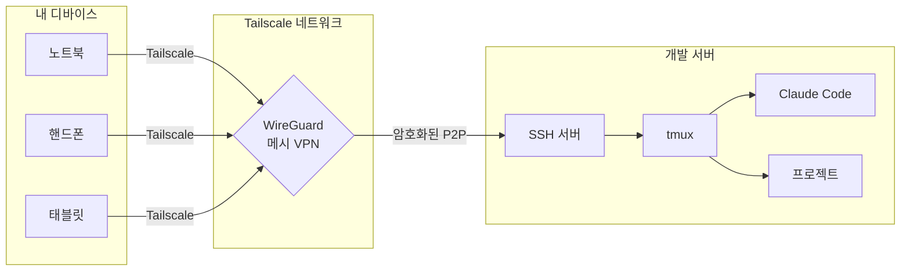

# Tailscale + SSH + tmux + Claude Code

### 어디서든 원격 개발하기 — 핸드폰에서도.

[](LICENSE)
[](CONTRIBUTING.md)
[](README.md)
[](#)

---

```
┌─────────────────────────────────────────────────────────────────┐
│                                                                 │
│   나          Tailscale (WireGuard 메시 VPN)      개발 서버     │
│                                                                 │
│  ┌──────┐         ┌──────────────┐              ┌──────────┐   │
│  │노트북│────────▶│  암호화된    │─────────────▶│  tmux    │   │
│  │핸드폰│────────▶│  P2P 터널   │─────────────▶│  + SSH   │   │
│  │태블릿│────────▶│  (WireGuard) │─────────────▶│  + Claude│   │
│  └──────┘         └──────────────┘              └──────────┘   │
│                                                                 │
│   어디서든 접속. 포트 포워딩 불필요. 공인 IP 불필요.            │
│   종단간 암호화. 연결이 끊겨도 세션 유지.                       │
│                                                                 │
└─────────────────────────────────────────────────────────────────┘
```

## 문제

집이나 클라우드에 강력한 개발 머신이 있습니다. 이런 걸 하고 싶죠:
- 카페에서 노트북으로 [Claude Code](https://claude.ai/code)를 돌리고 싶다
- 출퇴근 중 핸드폰으로 이어서 작업하고 싶다
- 연결이 끊겨도 작업을 잃고 싶지 않다
- SSH 키, 포트 포워딩, DDNS, 구린 VPN은 쓰기 싫다

## 해결책

**Tailscale**이 디바이스 간 암호화된 메시 네트워크를 만들어줍니다 — 설정 없이.
**SSH**로 개발 머신에 안전하게 접속합니다.
**tmux**가 연결이 끊겨도 세션을 살려둡니다.
**Claude Code**가 tmux 안에서 실행되어, 테일넷의 어떤 디바이스에서든 접근 가능합니다.

> **결과**: 서버에서 Claude Code를 시작하고, 노트북에서 SSH로 접속하고, 연결을 끊고, 핸드폰에서 SSH로 다시 접속하면, 정확히 그 자리에서 이어갈 수 있습니다.

## 완성되는 환경

```
┌─────────── tmux 세션 "dev" ─────────────────────────────────────┐
│                                                                  │
│  ┌─ 윈도우 1: claude ─────────────────────────────────────────┐ │
│  │ $ claude                                                    │ │
│  │ ╭────────────────────────────────────────────╮              │ │
│  │ │  Claude Code CLI - 준비 완료               │              │ │
│  │ │  작업 중: ~/projects/my-app                │              │ │
│  │ ╰────────────────────────────────────────────╯              │ │
│  └─────────────────────────────────────────────────────────────┘ │
│  ┌─ 윈도우 2: code ──────────────────┬────────────────────────┐ │
│  │ $ vim src/app.tsx                 │ $ npm run dev           │ │
│  │                                   │ Server running on :3000 │ │
│  │  (에디터 - 70%)                   │ (서버 - 30%)           │ │
│  └───────────────────────────────────┴────────────────────────┘ │
│  ┌─ 윈도우 3: git ────────────────────────────────────────────┐ │
│  │ $ git status                                                │ │
│  └─────────────────────────────────────────────────────────────┘ │
│                                                                  │
│  [dev] 1:claude* 2:code 3:git                  2025-04-07 14:30 │
└──────────────────────────────────────────────────────────────────┘
```

## 빠른 시작 (5분)

```bash
# 1. 서버에 Tailscale 설치
curl -fsSL https://tailscale.com/install.sh | sh
sudo tailscale up
tailscale set --ssh

# 2. 클라이언트(노트북/핸드폰)에 Tailscale 설치
# → https://tailscale.com/download 에서 다운로드

# 3. 서버에 SSH 접속 (SSH 키 필요 없음!)
ssh user@your-server-name

# 4. 서버에 tmux + Claude Code 설치
sudo apt install tmux        # 또는: brew install tmux
npm install -g @anthropic-ai/claude-code

# 5. 영구 개발 세션 시작
tmux new -s dev
claude
# 분리: Ctrl-a + d  |  나중에 재접속: tmux a -t dev
```

끝입니다. 이제 어디서든 접근 가능한 영구 Claude Code 세션이 생겼습니다.

## 전체 가이드

| 단계 | 주제 | EN | KO |
|------|------|----|----|
| 1 | Tailscale 설치 및 설정 | [English](docs/en/01-tailscale-setup.md) | [한국어](docs/ko/01-tailscale-setup.md) |
| 2 | Tailscale SSH 설정 | [English](docs/en/02-ssh-configuration.md) | [한국어](docs/ko/02-ssh-configuration.md) |
| 3 | tmux 설치 및 설정 | [English](docs/en/03-tmux-setup.md) | [한국어](docs/ko/03-tmux-setup.md) |
| 4 | tmux 패인 & 워크플로우 | [English](docs/en/04-tmux-workflow.md) | [한국어](docs/ko/04-tmux-workflow.md) |
| 5 | 핸드폰에서 접속하기 | [English](docs/en/05-mobile-access.md) | [한국어](docs/ko/05-mobile-access.md) |
| 6 | Claude Code 원격 실행 | [English](docs/en/06-claude-code-setup.md) | [한국어](docs/ko/06-claude-code-setup.md) |
| 7 | 고급 팁 & 트릭 | [English](docs/en/07-advanced-tips.md) | [한국어](docs/ko/07-advanced-tips.md) |

## 아키텍처



## 포함된 설정 파일

| 파일 | 설명 |
|------|------|
| [`configs/.tmux.conf`](configs/.tmux.conf) | 실전용 tmux 설정 — 합리적인 기본값, 직관적인 키바인딩, 플러그인 세팅 |
| [`configs/dev-session.sh`](configs/dev-session.sh) | Claude Code 개발을 위한 미리 정의된 tmux 레이아웃 스크립트 |

## 왜 이 스택인가?

| 도구 | 해결하는 문제 | 대안 | 이게 더 나은 이유 |
|------|---------------|------|-------------------|
| **Tailscale** | 네트워크 접근 | 포트 포워딩, ngrok, 전통적 VPN | 제로 설정, NAT 뒤에서도 동작, P2P 암호화, 무료 |
| **Tailscale SSH** | 인증 | SSH 키, 인증서 | 자동 키 관리, SSO 연동, ACL 정책 |
| **tmux** | 세션 영속성 | screen, Zellij, nohup | 검증된 도구, 강력한 패인, 거대한 생태계, 스크립팅 가능 |
| **Claude Code** | AI 코딩 어시스턴트 | — | 터미널에서 실행, 원격 tmux 세션에 최적 |
| **Termius** | 모바일 SSH | Blink Shell, JuiceSSH | 크로스 플랫폼, 좋은 UX, 키보드 단축키, SFTP |

## 사전 요구 사항

- 원격 접속할 서버 또는 데스크톱 (Linux 권장, macOS도 가능)
- 클라이언트 디바이스 (노트북, 핸드폰, 또는 태블릿)
- Tailscale 계정 ([개인 사용 무료](https://tailscale.com/pricing))
- Node.js 18+ (Claude Code용)

## 기여하기

기여는 환영합니다! [CONTRIBUTING.md](CONTRIBUTING.md)를 참고하세요.

유용하셨다면 스타를 누르고, 원격 근무하는 분들에게 공유해주세요.

## 라이선스

[MIT](LICENSE) — 자유롭게 사용하세요.
