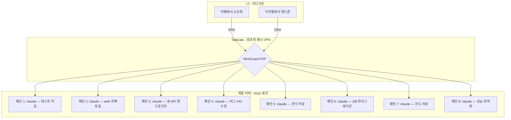
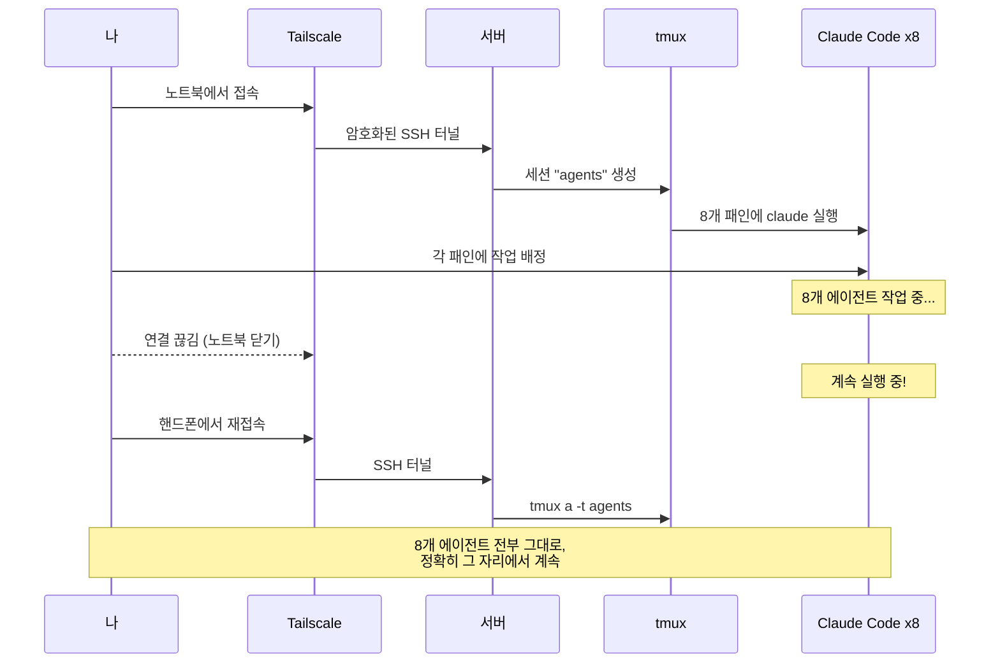

# Tailscale + SSH + tmux + Claude Code

### Claude Code 에이전트 8개를 동시에 돌리세요 — 핸드폰에서도.

[](LICENSE)
[](CONTRIBUTING.md)
[](README.md)
[](#)

---

## 아이디어

강력한 개발 머신 한 대. tmux 패인에서 동시에 8개의 Claude Code 에이전트가 돌아갑니다. 하나는 테스트 작성, 하나는 리팩토링, 하나는 새 기능 개발, 하나는 버그 수정. Tailscale의 암호화된 메시 네트워크를 통해 노트북, 핸드폰, 태블릿 어디서든 접속 가능합니다.



> **서버에서 에이전트 8개를 시작하세요. 노트북에서 SSH 접속. 연결 끊기. 핸드폰에서 다시 접속. 8개 에이전트 전부 그 자리에서 계속 돌아가고 있습니다.**

## 완성되는 환경

```
┌─ tmux: Claude Code 에이전트 8개 ───────────────────────────┐
│                                                            │
│  ┌─ 패인 1 ──────────┬─ 패인 2 ──────────┐               │
│  │ claude             │ claude             │               │
│  │ > 유저 API 테스트  │ > auth 모듈        │               │
│  │   작성 중...       │   리팩토링 중...   │               │
│  ├─ 패인 3 ──────────┼─ 패인 4 ──────────┤               │
│  │ claude             │ claude             │               │
│  │ > 새 REST          │ > 결제 버그 #42    │               │
│  │   엔드포인트...    │   수정 중...       │               │
│  ├─ 패인 5 ──────────┼─ 패인 6 ──────────┤               │
│  │ claude             │ claude             │               │
│  │ > API 문서         │ > v2 스키마        │               │
│  │   작성 중...       │   마이그레이션...  │               │
│  ├─ 패인 7 ──────────┼─ 패인 8 ──────────┤               │
│  │ claude             │ claude             │               │
│  │ > PR #128          │ > 쿼리 성능        │               │
│  │   리뷰 중...       │   최적화 중...     │               │
│  └───────────────────┴────────────────────┘               │
│                                                            │
│  [agents] 1:agents*                       2025-04-07 14:30 │
└────────────────────────────────────────────────────────────┘
```

**왜 8개를 동시에?** 각 Claude Code 에이전트가 독립적으로 자기만의 git worktree나 프로젝트 디렉토리에서 작업합니다. 작업을 배정하고, 패인을 전환하며 진행 상황을 모니터링하고, 결과를 머지하면 됩니다. 시니어 개발자 8명이 쉬지 않고 일하는 것과 같습니다.

## 빠른 시작 (5분)

```bash
# 1. 서버에 Tailscale 설치
curl -fsSL https://tailscale.com/install.sh | sh
sudo tailscale up
tailscale set --ssh

# 2. 클라이언트(노트북/핸드폰)에 Tailscale 설치
# → https://tailscale.com/download 에서 다운로드

# 3. 서버에 SSH 접속 (SSH 키 필요 없음!)
ssh user@your-server-name

# 4. 서버에 tmux + Claude Code 설치
sudo apt install tmux
npm install -g @anthropic-ai/claude-code

# 5. Claude Code 에이전트 8개를 동시에 실행!
./configs/dev-session.sh 8
# → 8개 패인이 있는 tmux 세션 생성, 각각 claude 실행 준비 완료

# 6. 각 패인에 작업 배정
# 패인 전환: Alt + 방향키 (prefix 불필요)
# 패인 확대: Ctrl-a + z
# 분리 (에이전트 계속 실행): Ctrl-a + d
# 어디서든 재접속: tmux a -t agents
```

## 워크플로우



## 전체 가이드

| 단계 | 주제 | EN | KO |
|------|------|----|----|
| 1 | Tailscale 설치 및 설정 | [English](docs/en/01-tailscale-setup.md) | [한국어](docs/ko/01-tailscale-setup.md) |
| 2 | Tailscale SSH 설정 | [English](docs/en/02-ssh-configuration.md) | [한국어](docs/ko/02-ssh-configuration.md) |
| 3 | tmux 설치 및 설정 | [English](docs/en/03-tmux-setup.md) | [한국어](docs/ko/03-tmux-setup.md) |
| 4 | tmux 패인 & 워크플로우 | [English](docs/en/04-tmux-workflow.md) | [한국어](docs/ko/04-tmux-workflow.md) |
| 5 | 핸드폰에서 접속하기 | [English](docs/en/05-mobile-access.md) | [한국어](docs/ko/05-mobile-access.md) |
| 6 | Claude Code 8개 동시 실행 | [English](docs/en/06-claude-code-setup.md) | [한국어](docs/ko/06-claude-code-setup.md) |
| 7 | 고급 팁 & 트릭 | [English](docs/en/07-advanced-tips.md) | [한국어](docs/ko/07-advanced-tips.md) |

## 왜 이 스택인가?

| 도구 | 하는 일 |
|------|---------|
| **Tailscale** | 암호화 메시 VPN. 포트 포워딩 없이, 공인 IP 없이. NAT 뒤에서도 동작. 무료. |
| **Tailscale SSH** | SSH 키를 완전히 대체. 자동 키 관리 + SSO. |
| **tmux** | 터미널 멀티플렉서. 한 세션에 8개 패인. 연결 끊겨도 유지. |
| **Claude Code** | 터미널 AI 코딩 에이전트. 헤드리스 원격 세션에 최적. |
| **Termius** | 최고의 모바일 SSH 클라이언트. 핸드폰에서 에이전트 관리. |

## 포함된 설정 파일

| 파일 | 설명 |
|------|------|
| [`configs/.tmux.conf`](configs/.tmux.conf) | 프로덕션급 tmux 설정 — Ctrl-a prefix, 직관적 분할, 마우스 지원, 플러그인 |
| [`configs/dev-session.sh`](configs/dev-session.sh) | 실행 스크립트 — N개의 Claude Code 패인을 타일 레이아웃으로 생성 (기본: 8) |

## 사전 요구 사항

- 원격 접속할 서버 또는 데스크톱 (Linux 권장, macOS도 가능)
- 클라이언트 디바이스 (노트북, 핸드폰, 또는 태블릿)
- [Tailscale 계정](https://tailscale.com/pricing) (개인 사용 무료)
- Node.js 18+ (Claude Code용)

## 기여하기

기여는 환영합니다! [CONTRIBUTING.md](CONTRIBUTING.md)를 참고하세요.

## 라이선스

[MIT](LICENSE)
