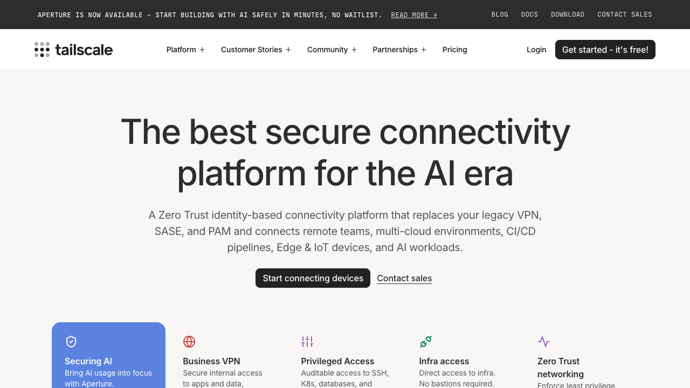
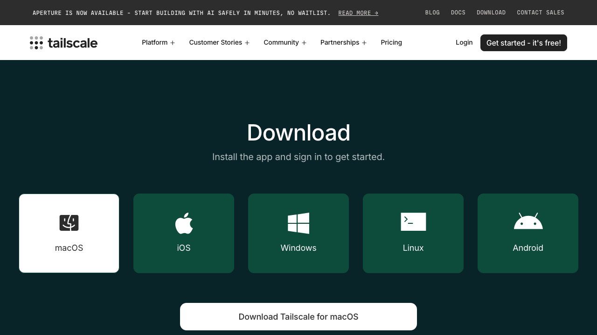
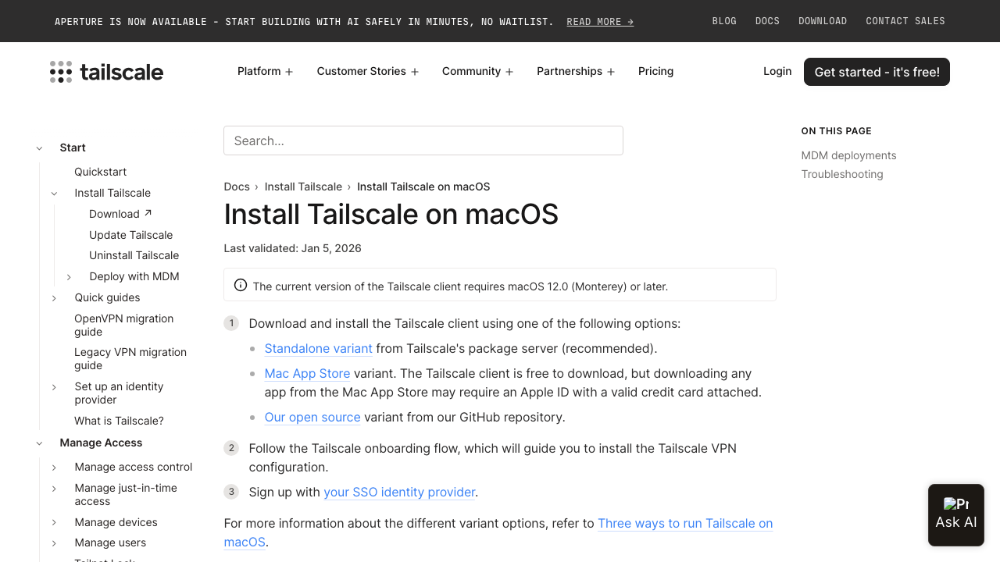
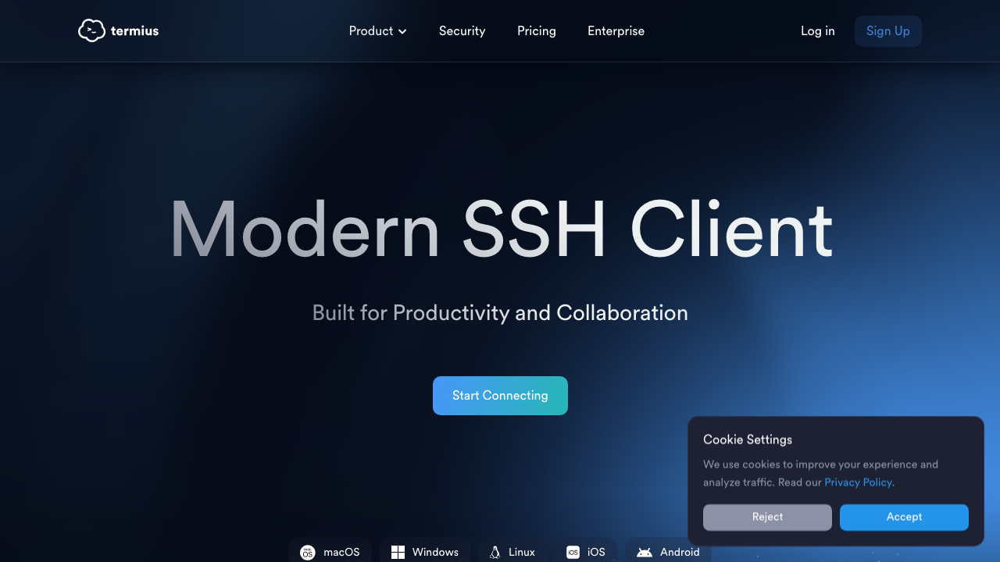

# MacBook에서 MacBook으로: Tailscale + SSH + tmux로 Claude Code 8개 동시에 돌리기

집/사무실 맥북(개발 머신)에 Tailscale을 세팅하면, 카페/회사/지하철 어디서든 다른 맥북으로 접속해서 **Claude Code 에이전트 8개를 동시에** 돌릴 수 있습니다. 연결이 끊겨도 전부 살아있습니다.

---

## 이게 왜 필요한가요?

Claude Code는 터미널에서 돌아가는 AI 코딩 에이전트입니다. 강력한 맥북에서 8개를 동시에 돌려놓고, 다른 맥북이나 태블릿에서 접속하면:

- 하나는 테스트 작성, 하나는 리팩토링, 하나는 버그 수정... **동시에**
- 카페에서 작업하다 노트북 닫아도 **8개 전부 계속 돌아감**
- 집에 와서 다시 접속하면 **정확히 그 자리에서 이어감**
- SSH 키, 포트 포워딩, 복잡한 VPN 설정 **전혀 필요 없음**

---

## Step 1. Tailscale 가입하기

[tailscale.com](https://tailscale.com)에 접속해서 오른쪽 위 **"Get started - it's free!"** 버튼을 누르세요.



가입 화면이 나옵니다. Google, GitHub, Apple 등으로 가입할 수 있습니다.


> **꿀팁: 반드시 개인 계정으로 가입하세요.**
>
> 회사 Google Workspace 계정으로 하면 나중에 퇴사할 때 세팅을 처음부터 다시 해야 합니다. 개인 Gmail이나 GitHub 계정으로 가입하는 걸 강력히 추천합니다. 무료 플랜(Personal)으로 충분합니다 — 기기 100대까지 됩니다.

---

## Step 2. 개발용 맥북에 Tailscale 설치하기 (서버 역할)

[tailscale.com/download](https://tailscale.com/download)에서 macOS를 선택하세요.



**"Download Tailscale for macOS"** 버튼을 누르면 독립형(Standalone) 버전이 다운로드됩니다.

설치 후 메뉴바에 Tailscale 아이콘이 뜹니다. 클릭해서 Step 1에서 만든 **같은 계정**으로 로그인하세요.

> **주의: macOS에는 Tailscale이 3가지 버전이 있습니다!**
>
> 
>
> | 버전 | SSH 서버 | 추천 |
> |------|---------|------|
> | **Standalone** (독립형) | X | 클라이언트용으로 추천 |
> | **Mac App Store** | X | 클라이언트용으로 추천 |
> | **Open Source CLI** | **O** | 서버 역할 맥북에 필수! |
>
> **서버 역할을 할 맥북에서 SSH로 접속받으려면 Open Source CLI 버전이 필요합니다.** App Store나 Standalone 버전은 SSH 클라이언트로만 동작하고, SSH 서버 기능이 없습니다.
>
> 처음에 App Store 버전을 깔았다가 SSH가 안 되면 이것 때문입니다. CLI 버전으로 바꾸세요.

### Open Source CLI 설치 방법 (서버 맥북)

```bash
# Homebrew로 설치
brew install tailscale

# tailscaled 데몬 시작
sudo tailscaled &

# 로그인
tailscale up

# SSH 서버 활성화 — 이게 핵심!
tailscale set --ssh
```

`tailscale set --ssh`를 실행하면 이 맥북이 Tailscale 네트워크에서 SSH 서버로 동작합니다. SSH 키 설정이 전혀 필요 없습니다 — Tailscale이 알아서 처리합니다.

```bash
# 잘 되는지 확인
tailscale status
```

내 맥북 이름과 IP가 보이면 성공입니다.

---

## Step 3. 다른 맥북에 Tailscale 설치하기 (클라이언트 역할)

카페나 회사에서 쓸 맥북에도 Tailscale을 설치합니다. 이쪽은 SSH 서버가 필요 없으니까 **App Store 버전이든 Standalone이든 아무거나** 괜찮습니다.

설치 후 **Step 1과 같은 계정**으로 로그인하세요. 같은 계정으로 로그인한 기기끼리 자동으로 암호화 네트워크가 만들어집니다.

> **시행착오 노트:**
>
> - 두 맥북이 같은 와이파이에 있을 필요 **없습니다**. 집과 카페처럼 완전히 다른 네트워크에 있어도 됩니다.
> - 방화벽이나 공유기 설정을 건드릴 필요가 **전혀 없습니다**. Tailscale이 NAT 뒤에서도 자동으로 연결합니다.
> - 가끔 회사 네트워크에서 Tailscale이 차단되는 경우가 있는데, 이때는 핸드폰 핫스팟으로 우회하면 됩니다.

---

## Step 4. SSH로 접속하기

클라이언트 맥북에서 터미널을 열고:

```bash
ssh 사용자이름@서버맥북이름
```

예를 들어 서버 맥북의 Tailscale 이름이 `macbook-pro`이고 사용자 이름이 `hyun`이면:

```bash
ssh hyun@macbook-pro
```

> **SSH 키 설정을 안 했는데 어떻게 되나요?**
>
> Tailscale SSH는 기존 SSH와 다릅니다. SSH 키 대신 Tailscale 계정 인증을 사용합니다. 같은 계정으로 로그인되어 있으면 바로 접속됩니다. `~/.ssh/authorized_keys`를 만질 필요가 없습니다.
>
> 처음 접속할 때 브라우저가 열리면서 Tailscale 로그인을 한 번 더 요청할 수 있습니다. 정상입니다 — 보안을 위한 재인증(check mode)입니다.

---

## Step 5. tmux 설치하기

서버 맥북에서:

```bash
brew install tmux
```

tmux가 뭐냐면 — 터미널 안에서 여러 개의 터미널을 돌릴 수 있는 프로그램입니다. 핵심은 **SSH 연결이 끊겨도 tmux 안의 프로그램이 계속 돌아간다**는 겁니다.

### tmux 설정 복사 (선택사항이지만 추천)

이 레포에 포함된 설정 파일을 복사하면 사용이 훨씬 편합니다:

```bash
# 이 레포를 클론하고
git clone https://github.com/KoreanThinker/tailscale-ssh-tmux-claude-code.git
cd tailscale-ssh-tmux-claude-code

# tmux 설정 복사
cp configs/.tmux.conf ~/.tmux.conf
```

바뀌는 것들:
- `Ctrl-b` 대신 **`Ctrl-a`** 를 prefix로 사용 (누르기 편함)
- `|`로 좌우 분할, `-`로 상하 분할 (직관적)
- `Alt + 방향키`로 패인 이동 (prefix 안 눌러도 됨)
- 마우스 클릭으로 패인 전환 가능

---

## Step 6. Claude Code 설치하기

서버 맥북에서:

```bash
npm install -g @anthropic-ai/claude-code
```

> Node.js가 없으면 먼저 설치하세요: `brew install node`

---

## Step 7. Claude Code 8개 동시에 돌리기

**여기가 이 가이드의 핵심입니다.**

### 방법 1: 스크립트 사용 (추천)

```bash
# 이 레포의 스크립트로 한방에
./configs/dev-session.sh 8
```

8개 패인이 타일 레이아웃으로 쫙 펼쳐집니다.

### 방법 2: 수동으로 하기

```bash
# 새 tmux 세션 만들기
tmux new -s agents

# 패인 분할 (prefix = Ctrl-a)
# Ctrl-a + |  → 좌우 분할
# Ctrl-a + -  → 상하 분할
# 이걸 반복해서 8개까지 만들기

# 타일 레이아웃으로 정렬
# Ctrl-a + Space (여러 번 눌러서 tiled 레이아웃 선택)
```

### 각 패인에서 Claude Code 실행

각 패인으로 이동해서 `claude`를 입력하고 작업을 지시합니다:

| 패인 | 작업 예시 |
|------|----------|
| 1 | "auth 모듈 유닛 테스트 작성해줘" |
| 2 | "데이터베이스 레이어 리팩토링해줘" |
| 3 | "새 API 엔드포인트 만들어줘" |
| 4 | "결제 버그 수정해줘" |
| 5 | "API 문서 작성해줘" |
| 6 | "DB 마이그레이션 만들어줘" |
| 7 | "PR 리뷰해줘" |
| 8 | "느린 쿼리 최적화해줘" |

### 핵심 단축키

| 동작 | 단축키 |
|------|--------|
| 패인 이동 | `Alt + 방향키` |
| 패인 확대 (전체화면) | `Ctrl-a` → `z` |
| 패인 확대 해제 | `Ctrl-a` → `z` (다시) |
| tmux에서 빠져나오기 (에이전트 계속 실행) | `Ctrl-a` → `d` |
| 다시 접속하기 | `tmux a -t agents` |

> **이게 진짜 강력한 이유:**
>
> `Ctrl-a` → `d`로 빠져나와도 8개 에이전트가 전부 계속 돌아갑니다. 맥북을 닫아도, 와이파이가 끊겨도, 카페에서 집으로 이동해도 — 서버 맥북에서 tmux가 살아있는 한 에이전트들은 멈추지 않습니다.
>
> 다른 맥북에서 `ssh hyun@macbook-pro` → `tmux a -t agents` 하면 8개 패인이 그대로 보입니다.

---

## Step 8. 일하는 루틴

1. 아침에 서버 맥북 켜기 (또는 항상 켜둠)
2. 아무 맥북에서 `ssh hyun@macbook-pro` → `tmux a -t agents`
3. 각 패인에 작업 배정 — `Alt + 방향키`로 돌아다니면서
4. 궁금한 패인은 `Ctrl-a` → `z`로 전체화면
5. 외출할 때 `Ctrl-a` → `d`로 빠져나오기 (에이전트 계속 실행)
6. 카페 도착 → 다시 접속 → 전부 그대로

---

## 자주 하는 실수 & 해결법

| 증상 | 원인 | 해결 |
|------|------|------|
| SSH 접속이 안 됨 | App Store 버전 Tailscale 사용 | 서버 맥북에 CLI 버전 설치 |
| `tailscale set --ssh` 에러 | tailscaled가 안 돌고 있음 | `sudo tailscaled &` 먼저 실행 |
| tmux 재접속이 안 됨 | 세션 이름을 잊음 | `tmux ls`로 세션 목록 확인 |
| 키보드 입력이 이상함 | tmux 설정 없이 사용 | `.tmux.conf` 복사 |
| 연결이 느림 | 두 맥북 사이 물리적 거리 | Tailscale은 P2P라 큰 문제 없음 |

---

## 포함된 설정 파일

| 파일 | 설명 |
|------|------|
| [`configs/.tmux.conf`](configs/.tmux.conf) | tmux 설정 — Ctrl-a prefix, 직관적 분할, 마우스 지원, 플러그인 |
| [`configs/dev-session.sh`](configs/dev-session.sh) | Claude Code N개 패인 실행 스크립트 (기본 8개) |

---

## Extra: 태블릿에서 지하철 와이파이로 접속하기

맥북이 아니라 **iPad**에서도 접속할 수 있습니다. 지하철 와이파이, 카페 와이파이, 핫스팟 — 네트워크 종류 상관없이 됩니다.



### 필요한 앱

1. **Tailscale** — [App Store](https://apps.apple.com/app/tailscale/id1470499037)에서 설치, 같은 계정으로 로그인
2. **Termius** — [App Store](https://apps.apple.com/app/termius-terminal-ssh-client/id549039908)에서 설치 (무료, 최고의 모바일 SSH 앱)

### 접속 방법

1. iPad에서 Termius 열기
2. 새 호스트 추가 → Hostname에 서버 맥북의 Tailscale 이름 입력 (예: `macbook-pro`)
3. Username 입력
4. 접속!
5. `tmux a -t agents` 입력 → 8개 패인이 태블릿에서 바로 보임

### 태블릿 팁

- `Ctrl-a` → `z`로 패인 확대하면 전체화면이 돼서 읽기 편합니다
- 가로 모드가 tmux에 훨씬 좋습니다
- 블루투스 키보드가 있으면 거의 맥북 수준으로 쓸 수 있습니다
- Termius의 키보드 바에서 Ctrl, Alt 등 특수키를 누를 수 있습니다

> 지하철 와이파이처럼 불안정한 네트워크에서도 Tailscale이 자동으로 재연결합니다. 연결이 잠깐 끊겨도 tmux 세션은 살아있으니까 `tmux a -t agents`로 다시 붙으면 됩니다.

---

## 참고 링크

- [Tailscale](https://tailscale.com) — 무료 메시 VPN
- [Tailscale SSH 문서](https://tailscale.com/docs/features/tailscale-ssh)
- [macOS에 Tailscale 설치](https://tailscale.com/docs/install/mac)
- [Claude Code](https://claude.ai/code) — AI 코딩 에이전트
- [Termius](https://termius.com) — 모바일 SSH 클라이언트
- [tmux 치트시트](https://tmuxcheatsheet.com)

---

MIT License
