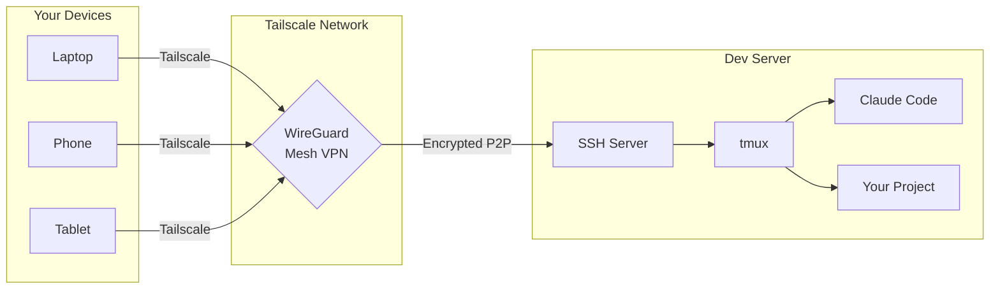

# Tailscale + SSH + tmux + Claude Code

### The ultimate guide to remote development from anywhere — even your phone.

[](LICENSE)
[](CONTRIBUTING.md)
[](#)
[](README.ko.md)

---

```
┌─────────────────────────────────────────────────────────────────┐
│                                                                 │
│   You         Tailscale (WireGuard mesh VPN)      Dev Server    │
│                                                                 │
│  ┌──────┐         ┌──────────────┐              ┌──────────┐   │
│  │Laptop│────────▶│  Encrypted   │─────────────▶│  tmux    │   │
│  │Phone │────────▶│  P2P Tunnel  │─────────────▶│  + SSH   │   │
│  │Tablet│────────▶│  (WireGuard) │─────────────▶│  + Claude│   │
│  └──────┘         └──────────────┘              └──────────┘   │
│                                                                 │
│   Access from anywhere. No port forwarding. No public IP.       │
│   Encrypted end-to-end. Sessions persist across disconnects.    │
│                                                                 │
└─────────────────────────────────────────────────────────────────┘
```

## The Problem

You have a powerful dev machine at home or in the cloud. You want to:
- Run [Claude Code](https://claude.ai/code) on it from your laptop at a coffee shop
- Continue a session from your phone while commuting
- Never lose work when your connection drops
- Not deal with SSH keys, port forwarding, dynamic DNS, or VPNs that suck

## The Solution

**Tailscale** creates an encrypted mesh network between your devices — no config needed.
**SSH** gives you a secure terminal connection to your dev machine.
**tmux** keeps your sessions alive even when you disconnect.
**Claude Code** runs in tmux, accessible from any device in your tailnet.

> **Result**: Start Claude Code on your server, SSH in from your laptop, disconnect, SSH in from your phone, pick up exactly where you left off.

## What You'll Build

```
┌─────────── tmux session "dev" ──────────────────────────────────┐
│                                                                  │
│  ┌─ Window 1: claude ──────────────────────────────────────────┐│
│  │ $ claude                                                     ││
│  │ ╭────────────────────────────────────────────╮               ││
│  │ │  Claude Code CLI - Ready                   │               ││
│  │ │  Working on: ~/projects/my-app             │               ││
│  │ ╰────────────────────────────────────────────╯               ││
│  └──────────────────────────────────────────────────────────────┘│
│  ┌─ Window 2: code ───────────────────┬─────────────────────────┐│
│  │ $ vim src/app.tsx                  │ $ npm run dev            ││
│  │                                    │ Server running on :3000  ││
│  │  (editor - 70%)                    │ (server - 30%)          ││
│  └────────────────────────────────────┴─────────────────────────┘│
│  ┌─ Window 3: git ─────────────────────────────────────────────┐│
│  │ $ git status                                                 ││
│  └──────────────────────────────────────────────────────────────┘│
│                                                                  │
│  [dev] 1:claude* 2:code 3:git                  2025-04-07 14:30 │
└──────────────────────────────────────────────────────────────────┘
```

## Quick Start (5 minutes)

```bash
# 1. Install Tailscale on your SERVER
curl -fsSL https://tailscale.com/install.sh | sh
sudo tailscale up
tailscale set --ssh

# 2. Install Tailscale on your CLIENT (laptop/phone)
# → Download from https://tailscale.com/download

# 3. SSH into your server (no keys needed!)
ssh user@your-server-name

# 4. Install tmux + Claude Code on the server
sudo apt install tmux        # or: brew install tmux
npm install -g @anthropic-ai/claude-code

# 5. Start a persistent dev session
tmux new -s dev
claude
# Detach: Ctrl-a + d  |  Reattach later: tmux a -t dev
```

That's it. You now have a persistent Claude Code session accessible from anywhere.

## Full Guide

| Step | Topic | EN | KO |
|------|-------|----|----|
| 1 | Install & Configure Tailscale | [English](docs/en/01-tailscale-setup.md) | [한국어](docs/ko/01-tailscale-setup.md) |
| 2 | Configure Tailscale SSH | [English](docs/en/02-ssh-configuration.md) | [한국어](docs/ko/02-ssh-configuration.md) |
| 3 | Install & Configure tmux | [English](docs/en/03-tmux-setup.md) | [한국어](docs/ko/03-tmux-setup.md) |
| 4 | tmux Panes & Workflow | [English](docs/en/04-tmux-workflow.md) | [한국어](docs/ko/04-tmux-workflow.md) |
| 5 | Access from Your Phone | [English](docs/en/05-mobile-access.md) | [한국어](docs/ko/05-mobile-access.md) |
| 6 | Running Claude Code Remotely | [English](docs/en/06-claude-code-setup.md) | [한국어](docs/ko/06-claude-code-setup.md) |
| 7 | Advanced Tips & Tricks | [English](docs/en/07-advanced-tips.md) | [한국어](docs/ko/07-advanced-tips.md) |

## Architecture



## Included Configs

| File | Description |
|------|-------------|
| [`configs/.tmux.conf`](configs/.tmux.conf) | Production-grade tmux config with sensible defaults, intuitive keybindings, and plugin setup |
| [`configs/dev-session.sh`](configs/dev-session.sh) | Script to create a predefined tmux layout for Claude Code development |

## Why This Stack?

| Tool | Problem it solves | Alternative | Why this is better |
|------|-------------------|-------------|-------------------|
| **Tailscale** | Network access | Port forwarding, ngrok, traditional VPN | Zero config, works behind NAT, P2P encrypted, free tier |
| **Tailscale SSH** | Authentication | SSH keys, certificates | Automatic key management, SSO integration, ACL policies |
| **tmux** | Session persistence | screen, Zellij, nohup | Battle-tested, powerful panes, huge ecosystem, scriptable |
| **Claude Code** | AI-assisted coding | — | Runs in terminal, perfect for remote tmux sessions |
| **Termius** | Mobile SSH | Blink Shell, JuiceSSH | Cross-platform, great UX, keyboard shortcuts, SFTP |

## Prerequisites

- A server or desktop you want to remote into (Linux recommended, macOS works too)
- A client device (laptop, phone, or tablet)
- A Tailscale account ([free for personal use](https://tailscale.com/pricing))
- Node.js 18+ (for Claude Code)

## Contributing

Contributions are welcome! See [CONTRIBUTING.md](CONTRIBUTING.md) for guidelines.

Found this useful? Give it a star and share it with others who work remotely.

## License

[MIT](LICENSE) — use it however you want.
