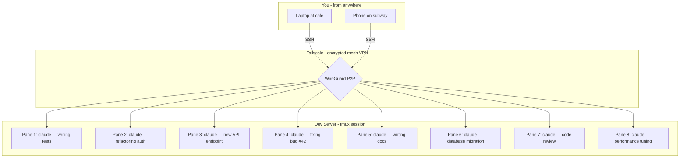
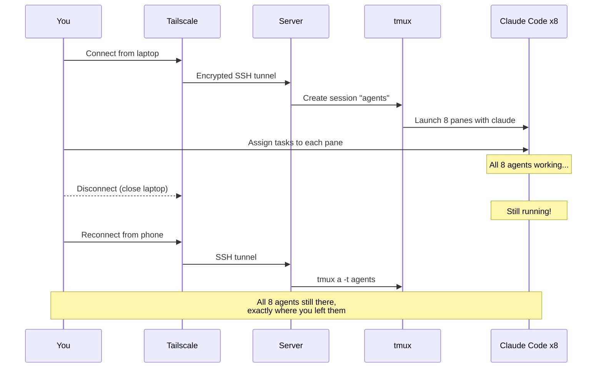

# Tailscale + SSH + tmux + Claude Code

### Run 8 Claude Code agents in parallel from anywhere — even your phone.

[](LICENSE)
[](CONTRIBUTING.md)
[](#)
[](README.ko.md)

---

## The Idea

One powerful dev machine. Eight Claude Code agents running simultaneously in tmux panes. Each working on a different task — one writing tests, one refactoring, one building a new feature, one fixing bugs. All accessible from your laptop, phone, or tablet through Tailscale's encrypted mesh network.



> **Start 8 agents on your server. SSH in from your laptop. Disconnect. SSH in from your phone. All 8 agents are still running, exactly where you left them.**

## What You'll Build

```
┌─ tmux: 8 Claude Code agents ──────────────────────────────┐
│                                                            │
│  ┌─ Pane 1 ──────────┬─ Pane 2 ──────────┐               │
│  │ claude             │ claude             │               │
│  │ > Writing tests    │ > Refactoring auth │               │
│  │   for user API...  │   module...        │               │
│  ├─ Pane 3 ──────────┼─ Pane 4 ──────────┤               │
│  │ claude             │ claude             │               │
│  │ > Building new     │ > Fixing bug #42   │               │
│  │   REST endpoint... │   in payments...   │               │
│  ├─ Pane 5 ──────────┼─ Pane 6 ──────────┤               │
│  │ claude             │ claude             │               │
│  │ > Writing API      │ > DB migration     │               │
│  │   documentation... │   for v2 schema... │               │
│  ├─ Pane 7 ──────────┼─ Pane 8 ──────────┤               │
│  │ claude             │ claude             │               │
│  │ > Reviewing PR     │ > Optimizing       │               │
│  │   #128 changes...  │   query perf...    │               │
│  └───────────────────┴────────────────────┘               │
│                                                            │
│  [agents] 1:agents*                       2025-04-07 14:30 │
└────────────────────────────────────────────────────────────┘
```

**Why 8 in parallel?** Because each Claude Code agent works independently in its own git worktree or project directory. You assign tasks, switch between panes to monitor progress, and merge results. It's like having a team of 8 senior developers — but they never sleep and never complain.

## Quick Start (5 minutes)

```bash
# 1. Install Tailscale on your SERVER
curl -fsSL https://tailscale.com/install.sh | sh
sudo tailscale up
tailscale set --ssh

# 2. Install Tailscale on your CLIENT (laptop/phone)
# → Download from https://tailscale.com/download

# 3. SSH into your server (no keys needed!)
ssh user@your-server-name

# 4. Install tmux + Claude Code on the server
sudo apt install tmux
npm install -g @anthropic-ai/claude-code

# 5. Launch 8 Claude Code agents in parallel!
./configs/dev-session.sh 8
# → Creates a tmux session with 8 panes, each ready for claude

# 6. Assign tasks to each pane
# Switch panes: Alt + Arrow keys (no prefix needed)
# Zoom into a pane: Ctrl-a + z
# Detach (agents keep running): Ctrl-a + d
# Reattach from anywhere: tmux a -t agents
```

## The Workflow



## Full Guide

| Step | Topic | EN | KO |
|------|-------|----|----|
| 1 | Install & Configure Tailscale | [English](docs/en/01-tailscale-setup.md) | [한국어](docs/ko/01-tailscale-setup.md) |
| 2 | Configure Tailscale SSH | [English](docs/en/02-ssh-configuration.md) | [한국어](docs/ko/02-ssh-configuration.md) |
| 3 | Install & Configure tmux | [English](docs/en/03-tmux-setup.md) | [한국어](docs/ko/03-tmux-setup.md) |
| 4 | tmux Panes & Workflow | [English](docs/en/04-tmux-workflow.md) | [한국어](docs/ko/04-tmux-workflow.md) |
| 5 | Access from Your Phone | [English](docs/en/05-mobile-access.md) | [한국어](docs/ko/05-mobile-access.md) |
| 6 | Running 8 Claude Codes in Parallel | [English](docs/en/06-claude-code-setup.md) | [한국어](docs/ko/06-claude-code-setup.md) |
| 7 | Advanced Tips & Tricks | [English](docs/en/07-advanced-tips.md) | [한국어](docs/ko/07-advanced-tips.md) |

## Why This Stack?

| Tool | What it does |
|------|-------------|
| **Tailscale** | Encrypted mesh VPN. No port forwarding, no public IP. Works behind any NAT. Free. |
| **Tailscale SSH** | Replaces SSH keys entirely. Automatic key management + SSO. |
| **tmux** | Terminal multiplexer. 8 panes in one session. Survives disconnects. |
| **Claude Code** | AI coding agent in the terminal. Perfect for headless remote sessions. |
| **Termius** | Best mobile SSH client. Manage your agents from your phone. |

## Included Configs

| File | Description |
|------|-------------|
| [`configs/.tmux.conf`](configs/.tmux.conf) | Production-grade tmux config — Ctrl-a prefix, intuitive splits, mouse support, plugins |
| [`configs/dev-session.sh`](configs/dev-session.sh) | Launch script — creates N Claude Code panes in a tiled layout (default: 8) |

## Prerequisites

- A server or desktop to remote into (Linux recommended, macOS works too)
- A client device (laptop, phone, or tablet)
- [Tailscale account](https://tailscale.com/pricing) (free for personal use)
- Node.js 18+ (for Claude Code)

## Contributing

Contributions welcome! See [CONTRIBUTING.md](CONTRIBUTING.md).

## License

[MIT](LICENSE)
