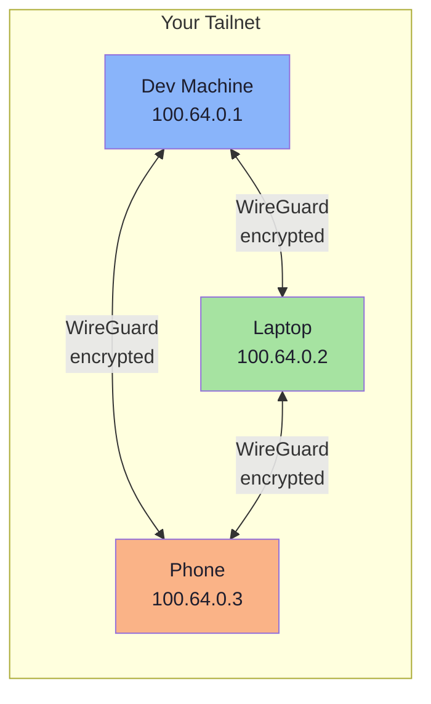

# Step 1: Install & Configure Tailscale

> **Goal:** Install Tailscale on your development machine so it becomes reachable from anywhere in the world — no port forwarding, no public IP, no firewall headaches.

---

## What is Tailscale?

Tailscale is a **mesh VPN** built on top of [WireGuard](https://www.wireguard.com/). It creates a private network (called a **tailnet**) between your devices — laptop, server, phone, cloud VM — and encrypts all traffic end-to-end.

Unlike traditional VPNs that route all traffic through a central server, Tailscale establishes **direct peer-to-peer connections** between devices whenever possible. This means:

- **Zero configuration networking** — no need to manage IP addresses or certificates
- **Works behind NATs and firewalls** — NAT traversal is built in; no port forwarding required
- **No single point of failure** — traffic flows directly between devices, not through a hub
- **Low latency** — direct connections mean minimal overhead



### Why Tailscale for remote development?

| Traditional approach | With Tailscale |
|---|---|
| Open port 22 on your router | No ports opened |
| Expose a public IP address | No public IP needed |
| Configure dynamic DNS | Access by hostname (MagicDNS) |
| Manage SSH keys manually | Automatic key management |
| VPN server as bottleneck | Direct peer-to-peer connections |
| Complex firewall rules | Simple ACL policies |

---

## Installation

### macOS

> **Critical: Understand the three macOS variants before you install.**

Tailscale for macOS comes in three different forms, and they are **not interchangeable**. Choosing the wrong one will block you from running the SSH server later.

| Variant | Install method | Runs as | SSH Server | Best for |
|---|---|---|---|---|
| **App Store** | Mac App Store | User-space (Network Extension) | Not supported | Clients only |
| **Standalone** | `tailscale.com/download` | User-space (System Extension) | Not supported | Clients only |
| **CLI (`tailscaled`)** | Homebrew / direct binary | System daemon | **Supported** | **Dev machines (use this)** |

> **If your machine will be the remote dev server you SSH into, you MUST use the CLI variant.** The App Store and Standalone apps cannot run Tailscale SSH because they operate in user space and lack the system-level integration required.

#### Install via Homebrew (recommended for dev machines)

```bash
brew install tailscale
```

This installs `tailscale` (the CLI client) and `tailscaled` (the daemon).

Start the daemon:

```bash
# Start tailscaled and enable it on boot
sudo brew services start tailscale
```

#### Install via App Store (client-only machines)

If this machine only needs to **connect to** other machines (not be connected to), the App Store version is fine. Search "Tailscale" in the Mac App Store and install.

### Linux

The one-liner installer works on most distributions:

```bash
curl -fsSL https://tailscale.com/install.sh | sh
```

This handles package repository setup and installs both `tailscale` and `tailscaled`.

For specific distributions:

```bash
# Ubuntu / Debian
sudo apt-get install -y tailscale

# Fedora / RHEL
sudo dnf install -y tailscale

# Arch
sudo pacman -S tailscale
```

Enable and start the daemon:

```bash
sudo systemctl enable --now tailscaled
```

### Windows

Download the installer from [tailscale.com/download/windows](https://tailscale.com/download/windows) or install via winget:

```bash
winget install Tailscale.Tailscale
```

---

## First Login

After installation, authenticate your device to join your tailnet:

```bash
sudo tailscale up
```

This prints a URL. Open it in your browser, sign in with your identity provider (Google, Microsoft, GitHub, etc.), and approve the device.

```
To authenticate, visit:

    https://login.tailscale.com/a/abc123def456

```

> **Tip:** If you are running headless (no browser on the machine), copy the URL and open it on any device where you are logged into Tailscale.

After successful authentication, you should see:

```
Success.
```

---

## Verify the Connection

### Check your device status

```bash
tailscale status
```

Expected output:

```
100.64.0.1   dev-machine    hyun@        linux   -
100.64.0.2   macbook-pro    hyun@        macOS   -
100.64.0.3   iphone         hyun@        iOS     -
```

Each row shows a device on your tailnet with its Tailscale IP, hostname, owner, OS, and connection status.

### Check your Tailscale IP

```bash
tailscale ip -4
```

```
100.64.0.1
```

This is the stable IP assigned to this device within your tailnet. It never changes, regardless of which physical network the device is on.

### Test connectivity between devices

From another device on your tailnet, ping your dev machine:

```bash
ping 100.64.0.1
```

```
PING 100.64.0.1 (100.64.0.1): 56 data bytes
64 bytes from 100.64.0.1: icmp_seq=0 ttl=64 time=4.123 ms
64 bytes from 100.64.0.1: icmp_seq=1 ttl=64 time=3.891 ms
```

---

## MagicDNS

MagicDNS is one of Tailscale's best features. It lets you access devices by **hostname** instead of IP address.

With MagicDNS enabled (it is enabled by default), instead of:

```bash
ssh user@100.64.0.1
```

You can simply use:

```bash
ssh user@dev-machine
```

### How MagicDNS names work

Each device gets a DNS name based on its hostname:

```
<hostname>.<tailnet-name>.ts.net
```

For example, if your device hostname is `dev-machine` and your tailnet is `tail1234.ts.net`:

- Short name: `dev-machine` (works within the tailnet)
- Full name: `dev-machine.tail1234.ts.net`

### Verify MagicDNS

```bash
tailscale status
```

Then from another device:

```bash
# Both of these should work
ping dev-machine
ping dev-machine.tail1234.ts.net
```

### Custom domain (optional)

In the Tailscale admin console, you can configure a custom domain for your tailnet under **DNS** settings. This changes `tail1234.ts.net` to something like `myteam.ts.net`.

---

## Tailscale Admin Console

Visit [login.tailscale.com/admin](https://login.tailscale.com/admin) to manage your tailnet:

- **Machines** — see all connected devices, their IPs, last seen time
- **DNS** — configure MagicDNS, nameservers, search domains
- **Access Controls** — define who can access what (we will configure this in [Step 2](./02-ssh-configuration.md))
- **Users** — manage team members and their devices

> **Screenshot location:** `../../assets/screenshots/` — you can add screenshots of the admin console for visual reference.

---

## Troubleshooting

### "tailscale up" hangs

```bash
# Check if the daemon is running
sudo systemctl status tailscaled   # Linux
sudo brew services list            # macOS
```

If the daemon is not running, start it first.

### Device appears offline in admin console

```bash
# Force re-authentication
sudo tailscale up --reset
```

### Cannot resolve MagicDNS names

```bash
# Check if MagicDNS is active
tailscale dns status

# Verify the device appears in tailscale status
tailscale status
```

Make sure MagicDNS is enabled in the admin console under **DNS** settings.

### Firewall blocking Tailscale

Tailscale uses UDP port 41641 for direct connections. If behind a strict corporate firewall, it falls back to DERP relay servers over HTTPS (port 443). If neither works:

```bash
# Check if direct connection is possible
tailscale netcheck
```

This shows NAT type, latency to DERP relays, and whether UDP is available.

---

## Summary

At this point, you should have:

- [x] Tailscale installed (CLI variant on your dev machine)
- [x] Device authenticated and joined to your tailnet
- [x] A stable Tailscale IP (100.x.y.z)
- [x] MagicDNS working (access by hostname)
- [x] Connectivity verified from another device

**Next:** [Step 2: Configure Tailscale SSH](./02-ssh-configuration.md) — enable SSH access through Tailscale with automatic authentication.
