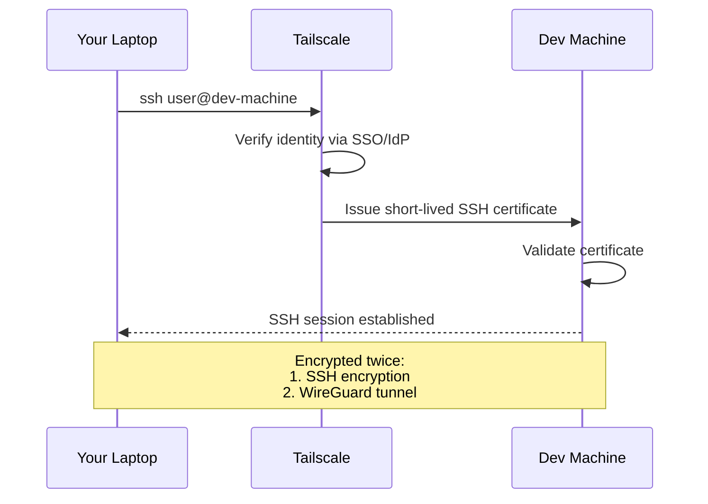

# Step 2: Configure Tailscale SSH

> **Goal:** Replace traditional SSH key management with Tailscale SSH — automatic authentication, dual encryption, and zero exposed ports.

**Prerequisites:** [Step 1: Install & Configure Tailscale](./01-tailscale-setup.md) completed on all devices.

---

## What is Tailscale SSH?

Tailscale SSH is a drop-in replacement for traditional SSH that eliminates the need to manage SSH keys, `authorized_keys` files, and port forwarding. When you SSH to a machine on your tailnet, Tailscale handles authentication using your identity provider (the same one you used to log into Tailscale).

### How it works



**Key differences from traditional SSH:**

| Traditional SSH | Tailscale SSH |
|---|---|
| Generate and distribute SSH keys | Automatic — uses your Tailscale identity |
| Manage `~/.ssh/authorized_keys` | No key files needed |
| Open port 22 on the firewall | No ports exposed to the internet |
| One layer of encryption (SSH) | **Dual encryption** (SSH + WireGuard) |
| Keys valid forever (unless revoked) | Short-lived certificates, auto-rotated |
| Manual key rotation | Automatic key management |

---

## Enable Tailscale SSH on Your Dev Machine

On the machine you want to SSH **into** (your dev server), run:

```bash
sudo tailscale set --ssh
```

That is it. One command. The machine now accepts SSH connections from authorized users on your tailnet.

> **Reminder:** This only works with the CLI variant of Tailscale on macOS. If you installed the App Store or Standalone version, Tailscale SSH is not available. See the [macOS variants table](./01-tailscale-setup.md#macos) in Step 1.

### Verify it is running

```bash
tailscale status
```

Your dev machine should show in the output. From another device on your tailnet:

```bash
ssh your-username@dev-machine
```

You should be logged in immediately — no password prompt, no key prompt.

---

## Access Control Lists (ACLs)

Tailscale ACLs define **who can access what** on your tailnet. By default, all devices on a personal tailnet can reach each other. For a more secure setup, configure explicit rules.

### Where to edit ACLs

Go to **[Tailscale Admin Console](https://login.tailscale.com/admin/acls)** > **Access Controls**.

### ACL structure

ACLs are written in JSON (with comments, known as HuJSON). The two relevant sections are:

1. **`acls`** — general network access rules
2. **`ssh`** — SSH-specific access rules

### Pattern 1: Personal use (single user)

The simplest setup — you can SSH from any of your devices to any other:

```jsonc
{
  // Allow all traffic between my devices
  "acls": [
    {
      "action": "accept",
      "src": ["*"],
      "dst": ["*:*"]
    }
  ],

  // SSH access: I can SSH as any user on any of my machines
  "ssh": [
    {
      "action": "accept",
      "src": ["autogroup:member"],
      "dst": ["autogroup:self"],
      "users": ["autogroup:nonroot", "root"]
    }
  ]
}
```

### Pattern 2: Team use (multiple users)

For teams, restrict SSH access based on groups:

```jsonc
{
  "groups": {
    "group:devs": ["alice@example.com", "bob@example.com"],
    "group:ops":  ["charlie@example.com"]
  },

  "acls": [
    {
      "action": "accept",
      "src": ["group:devs", "group:ops"],
      "dst": ["tag:dev-server:*"]
    }
  ],

  "ssh": [
    {
      // Devs can SSH as their own user
      "action": "accept",
      "src": ["group:devs"],
      "dst": ["tag:dev-server"],
      "users": ["autogroup:nonroot"]
    },
    {
      // Ops can SSH as root, but must re-authenticate
      "action": "accept",
      "src": ["group:ops"],
      "dst": ["tag:dev-server"],
      "users": ["root"]
    }
  ]
}
```

### Pattern 3: Root access with mandatory re-authentication

For security-sensitive environments, require re-authentication before allowing root access:

```jsonc
{
  "ssh": [
    {
      // Regular access — no extra auth needed
      "action": "accept",
      "src": ["autogroup:member"],
      "dst": ["autogroup:self"],
      "users": ["autogroup:nonroot"]
    },
    {
      // Root access — must re-authenticate via browser
      "action": "check",
      "src": ["autogroup:member"],
      "dst": ["autogroup:self"],
      "users": ["root"]
    }
  ]
}
```

The `"check"` action forces the user to re-authenticate through their identity provider before the SSH session is established. This is useful for root or sudo access.

### Understanding ACL keywords

| Keyword | Meaning |
|---|---|
| `autogroup:member` | All users in your tailnet |
| `autogroup:self` | Machines owned by the connecting user |
| `autogroup:nonroot` | Any non-root user on the target machine |
| `tag:dev-server` | Machines tagged with `dev-server` |
| `*` | All sources or destinations |

### Applying tags to machines

To use tag-based ACLs, tag your machines:

```bash
# Tag a machine as a dev server
sudo tailscale up --advertise-tags=tag:dev-server
```

And define tag ownership in ACLs:

```jsonc
{
  "tagOwners": {
    "tag:dev-server": ["autogroup:admin"]
  }
}
```

---

## Testing the Connection

From your client device (laptop, phone, etc.):

```bash
# Using MagicDNS hostname
ssh your-username@dev-machine

# Using full tailnet DNS name
ssh your-username@dev-machine.tail1234.ts.net

# Using Tailscale IP
ssh your-username@100.64.0.1
```

### Expected output

```
Welcome to Ubuntu 24.04 LTS (GNU/Linux 6.8.0-generic x86_64)

Last login: Mon Apr  7 10:23:45 2026 from 100.64.0.2
your-username@dev-machine:~$
```

No key prompts. No password prompts. Just a shell.

### Verify SSH is going through Tailscale

```bash
# Check the SSH connection details
ssh -v your-username@dev-machine 2>&1 | head -20
```

You should see references to the Tailscale IP (100.x.y.z) in the connection output.

---

## Secure Your Machine: Disable Traditional SSH

Now that Tailscale SSH handles authentication, you should close port 22 on your public-facing firewall. There is no reason to expose traditional SSH to the internet anymore.

> **Important:** Only close port 22 on the **public** firewall. Tailscale SSH operates over WireGuard on a completely separate channel — it does not use port 22 at all.

### On Linux (ufw)

```bash
# Remove the SSH allow rule from the public firewall
sudo ufw delete allow 22/tcp
sudo ufw status
```

### On Linux (iptables)

```bash
# Drop incoming SSH on the public interface
# (replace eth0 with your public-facing interface)
sudo iptables -A INPUT -i eth0 -p tcp --dport 22 -j DROP
```

### On macOS

Disable "Remote Login" in **System Settings** > **General** > **Sharing** > **Remote Login** (toggle it off).

### Verify port 22 is closed

From **outside** your tailnet (e.g., from a different network):

```bash
# This should timeout or be refused
ssh your-username@your-public-ip
```

From **inside** your tailnet:

```bash
# This should still work perfectly
ssh your-username@dev-machine
```

---

## Troubleshooting

### "Permission denied" when connecting

1. **Check ACLs** — make sure your user is allowed to SSH to the target machine:
   ```bash
   # On the client, check what the policy allows
   tailscale status
   ```

2. **Check the SSH user** — Tailscale SSH maps your Tailscale identity to a local user. The target machine must have a local user account matching the username you are connecting as:
   ```bash
   # On the target machine
   id your-username
   ```

3. **Re-authenticate** — if using `"check"` mode in ACLs:
   ```bash
   tailscale up --reauthenticate
   ```

### "Connection refused"

```bash
# Verify Tailscale SSH is enabled on the target
ssh your-username@dev-machine

# If it fails, check on the target machine
tailscale status
sudo tailscale set --ssh   # Re-enable if needed
```

### Slow initial connection

The first SSH connection may take 1-2 seconds longer as Tailscale establishes the WireGuard tunnel and issues the SSH certificate. Subsequent connections in the same session are near-instant.

### SSH config for convenience

You can add Tailscale hosts to your `~/.ssh/config` for convenience, although it is not required:

```
Host dev
    HostName dev-machine
    User your-username

Host dev-full
    HostName dev-machine.tail1234.ts.net
    User your-username
```

Then connect with just:

```bash
ssh dev
```

---

## Security Best Practices

1. **Use `check` mode for root access** — forces re-authentication via your identity provider before granting root.

2. **Enable MFA on your identity provider** — Tailscale SSH inherits the security of your SSO provider. If your Google/Microsoft/GitHub account has 2FA, your SSH connections do too.

3. **Key expiry** — Tailscale keys expire by default (180 days). You can adjust this in the admin console. Consider shorter expiry for sensitive machines.

4. **Audit logging** — Tailscale logs all SSH sessions in the admin console under **Logs**. Review these periodically.

5. **Disable key expiry only when necessary** — for always-on servers, you may need to disable key expiry. Do this per-machine, not globally:
   ```bash
   sudo tailscale up --auth-key=YOUR_AUTH_KEY
   ```
   Or disable expiry for specific machines in the admin console.

6. **Use tags for access control** — instead of allowing all members to SSH everywhere, tag machines and restrict access by role.

---

## Summary

At this point, you should have:

- [x] Tailscale SSH enabled on your dev machine (`tailscale set --ssh`)
- [x] ACLs configured for your use case (personal or team)
- [x] Verified SSH works from another device on your tailnet
- [x] Traditional SSH (port 22) closed on the public firewall
- [x] Security best practices in place

**Next:** [Step 3: Install & Configure tmux](./03-tmux-setup.md) — set up persistent terminal sessions that survive disconnections.
