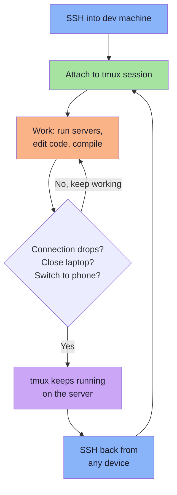

# Step 4: tmux Panes & Workflow Mastery

> **Goal:** Master tmux pane management, window workflows, and key bindings to build an efficient multi-pane development environment.

**Prerequisites:** [Step 3: Install & Configure tmux](./03-tmux-setup.md) completed.

---

## Pane Management

Panes are the core of tmux productivity. They let you see multiple terminals simultaneously — code on one side, server output on the other, git log at the bottom.

### Splitting

| Key | Action | Visual |
|---|---|---|
| `prefix + \|` | Split vertical (left/right) | `[A] → [A\|B]` |
| `prefix + -` | Split horizontal (top/bottom) | `[A] → [A / B]` |
| `prefix + \` | Same as `\|` (no Shift needed) | `[A] → [A\|B]` |

> **Mnemonic:** `|` is a vertical line (splits into left and right). `-` is a horizontal line (splits into top and bottom).

### Navigating

| Key | Action |
|---|---|
| `Alt + Left` | Move to pane on the left |
| `Alt + Right` | Move to pane on the right |
| `Alt + Up` | Move to pane above |
| `Alt + Down` | Move to pane below |
| `prefix + q` | Show pane numbers, then type a number to jump |

> `Alt + Arrow` requires no prefix — it is the fastest way to switch panes.

### Resizing

| Key | Action |
|---|---|
| `prefix + Ctrl + Arrow` | Resize by 5 cells |
| `prefix + Shift + Arrow` | Resize by 1 cell (fine-grained) |
| Mouse drag | Drag pane border (mouse mode enabled) |

### Zooming

| Key | Action |
|---|---|
| `prefix + z` | Toggle zoom (pane fills entire window) |

Zoom is incredibly useful. When you need to focus on one pane — to read a long stack trace, edit a file, or run Claude Code — zoom it to full screen. Press `prefix + z` again to return to the split layout.

> **Tip:** When accessing from a phone, zoom is essential. Small screens make split panes unreadable. Stay zoomed on the pane you are working in.

### Other pane operations

| Key | Action |
|---|---|
| `prefix + x` | Close the current pane (with confirmation) |
| `prefix + !` | Convert pane to its own window |
| `prefix + {` | Swap pane with the previous one |
| `prefix + }` | Swap pane with the next one |
| `prefix + Space` | Cycle through built-in layouts |

---

## Window Management

Windows are like tabs. Each window has its own set of panes.

| Key | Action |
|---|---|
| `prefix + c` | Create a new window |
| `prefix + ,` | Rename the current window |
| `prefix + &` | Close the current window (with confirmation) |
| `prefix + n` | Next window |
| `prefix + p` | Previous window |
| `prefix + 1-9` | Jump to window by number |
| `prefix + w` | Interactive window/session picker |
| `prefix + l` | Toggle to last active window |

> **Naming convention:** Give each window a descriptive name. Our `dev-session.sh` creates windows named `claude`, `code`, `server`, and `git`. Renaming: `prefix + ,` then type the new name.

---

## Session Management

Sessions are top-level containers. You might have one per project.

### From the shell (outside tmux)

```bash
# Create a new session
tmux new-session -s project-name

# List all sessions
tmux ls
```

Expected output:

```
dev: 4 windows (created Mon Apr  7 10:00:00 2026)
backend: 2 windows (created Mon Apr  7 11:30:00 2026)
```

```bash
# Attach to a session
tmux attach -t dev

# Attach, or create if it does not exist
tmux new-session -A -s dev

# Kill a session
tmux kill-session -t old-project
```

### From inside tmux

| Key | Action |
|---|---|
| `prefix + d` | Detach from current session |
| `prefix + s` | Interactive session picker |
| `prefix + $` | Rename current session |
| `prefix + (` | Switch to previous session |
| `prefix + )` | Switch to next session |

---

## The Killer Workflow: Disconnect and Reconnect

This is why tmux exists for remote development. Here is the complete workflow:



### Step by step

**1. SSH and attach (one command)**

```bash
ssh user@dev-machine -t "tmux attach -t dev || tmux new -s dev"
```

This SSHs in and either reattaches to the existing `dev` session or creates a new one. The `-t` flag allocates a TTY, which tmux requires.

**2. Work normally**

Run your dev server, edit files, use Claude Code — whatever you need.

**3. Disconnect (gracefully or not)**

- Intentional: `prefix + d` to detach, then `exit` the SSH session
- Unintentional: close your laptop, lose WiFi, walk away — it does not matter

**4. Reconnect from anywhere**

```bash
ssh user@dev-machine -t "tmux attach -t dev"
```

Everything is exactly as you left it. Running processes are still running. Output is still in the scrollback buffer. Your cursor is in the same position.

---

## Predefined Layouts with dev-session.sh

The [`configs/dev-session.sh`](../../configs/dev-session.sh) script creates a ready-to-use development environment with four purpose-built windows:

```bash
# Create/attach the default "dev" session
./configs/dev-session.sh

# Or specify a custom session name
./configs/dev-session.sh my-project
```

### What it creates

```
┌─────────────────────────────────────────────────────────────┐
│  Window 1: "claude"  │  Window 2: "code"                    │
│  ┌─────────────────┐ │  ┌─────────────────────────────────┐ │
│  │                 │ │  │         Editor (70%)             │ │
│  │  Claude Code    │ │  │         top pane                 │ │
│  │  (full pane)    │ │  ├─────────────────────────────────┤ │
│  │                 │ │  │     Terminal (30%)               │ │
│  │                 │ │  │     bottom pane                  │ │
│  └─────────────────┘ │  └─────────────────────────────────┘ │
├─────────────────────────────────────────────────────────────┤
│  Window 3: "server"  │  Window 4: "git"                     │
│  ┌────────┬────────┐ │  ┌─────────────────────────────────┐ │
│  │ Server │ Logs   │ │  │                                 │ │
│  │ (50%)  │ (50%)  │ │  │     Git operations              │ │
│  │        │        │ │  │     (full pane)                  │ │
│  │        │        │ │  │                                 │ │
│  └────────┴────────┘ │  └─────────────────────────────────┘ │
└─────────────────────────────────────────────────────────────┘
```

- **Window 1 (`claude`):** Full-screen pane running `claude` (Claude Code CLI)
- **Window 2 (`code`):** 70/30 split — editor on top, terminal on the bottom
- **Window 3 (`server`):** 50/50 vertical split — dev server on the left, logs on the right
- **Window 4 (`git`):** Full-screen pane for git operations

The script is **idempotent**: if the session already exists, it simply reattaches.

### Install the script

```bash
# Copy to a convenient location
cp configs/dev-session.sh ~/bin/dev-session
chmod +x ~/bin/dev-session

# Now you can run it from anywhere
dev-session
dev-session my-project
```

---

## Claude Code in tmux

Claude Code gets its own dedicated window because it works best with a full-screen terminal:

- Claude Code output can be long — full screen lets you read entire responses
- You can zoom (`prefix + z`) if you put it in a pane, but a dedicated window is cleaner
- Switch between Claude Code and your code editor with `prefix + 1` and `prefix + 2`

### Typical workflow

```
prefix + 1    →  Ask Claude Code to make a change
prefix + 2    →  Review the change in your editor
prefix + 3    →  Check if the dev server reloaded correctly
prefix + 4    →  Commit with git
prefix + 1    →  Ask Claude Code the next question
```

---

## Copy Mode and Scrollback

When you need to scroll through previous output (build logs, error messages, test results):

### Enter copy mode

```
prefix + v       (our custom binding)
prefix + [       (default binding)
```

### Navigate in copy mode

| Key | Action |
|---|---|
| `j` / `k` | Scroll down / up (line by line) |
| `Ctrl+d` / `Ctrl+u` | Scroll down / up (half page) |
| `g` / `G` | Jump to top / bottom |
| `/` | Search forward |
| `?` | Search backward |
| `n` / `N` | Next / previous search match |

### Select and copy

| Key | Action |
|---|---|
| `v` | Start selection |
| `Ctrl+v` | Rectangle (block) selection |
| `y` | Copy selection and exit copy mode |
| `q` | Exit copy mode without copying |

Copied text goes to the system clipboard via `tmux-yank`.

---

## Synchronize Panes

Run the same command simultaneously in multiple panes. Useful for operating on multiple servers or running the same test across environments.

```
prefix + :    →  type: setw synchronize-panes on
```

Now every keystroke is sent to **all panes in the current window**. Turn it off:

```
prefix + :    →  type: setw synchronize-panes off
```

> **Warning:** Be careful with synchronized panes. A `Ctrl+c` or `rm` goes to every pane.

---

## Complete Key Bindings Reference

### Session commands

| Key | Action |
|---|---|
| `prefix + d` | Detach |
| `prefix + s` | Session picker |
| `prefix + $` | Rename session |
| `prefix + (` | Previous session |
| `prefix + )` | Next session |

### Window commands

| Key | Action |
|---|---|
| `prefix + c` | New window |
| `prefix + ,` | Rename window |
| `prefix + &` | Close window |
| `prefix + n` | Next window |
| `prefix + p` | Previous window |
| `prefix + 1-9` | Go to window N |
| `prefix + w` | Window/session picker |
| `prefix + l` | Last active window |

### Pane commands

| Key | Action |
|---|---|
| `prefix + \|` | Split left/right |
| `prefix + -` | Split top/bottom |
| `prefix + \\` | Split left/right (no Shift) |
| `Alt + Arrow` | Navigate panes (no prefix!) |
| `prefix + Ctrl+Arrow` | Resize by 5 cells |
| `prefix + Shift+Arrow` | Resize by 1 cell |
| `prefix + z` | Toggle zoom |
| `prefix + x` | Close pane |
| `prefix + !` | Pane to window |
| `prefix + {` | Swap pane backward |
| `prefix + }` | Swap pane forward |
| `prefix + Space` | Cycle layouts |
| `prefix + q` | Show pane numbers |

### Copy mode

| Key | Action |
|---|---|
| `prefix + v` | Enter copy mode |
| `prefix + [` | Enter copy mode (default) |
| `v` | Begin selection |
| `Ctrl+v` | Rectangle selection |
| `y` | Copy and exit |
| `q` | Exit without copying |

### Utility

| Key | Action |
|---|---|
| `prefix + r` | Reload config |
| `prefix + :` | Command prompt |
| `prefix + ?` | List all key bindings |
| `prefix + t` | Show clock |
| `prefix + I` | Install TPM plugins |
| `prefix + U` | Update TPM plugins |

---

## Summary

At this point, you should be comfortable with:

- [x] Splitting, navigating, resizing, and zooming panes
- [x] Managing windows and sessions
- [x] The disconnect/reconnect workflow
- [x] Using `dev-session.sh` for predefined layouts
- [x] Copy mode for scrolling and copying output
- [x] Running Claude Code effectively in tmux

**Next:** [Step 5: Access from Your Phone](./05-mobile-access.md) — extend your development reach to mobile devices.
