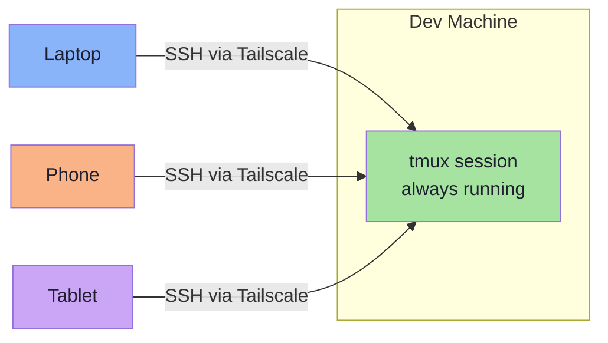

# Step 5: Access from Your Phone (Tailscale + Termius)

> **Goal:** Access your remote development environment from your phone. Start work on your laptop, continue from your phone during a commute, and switch back to your laptop when you get home — all without losing state.

**Prerequisites:** [Step 4: tmux Panes & Workflow Mastery](./04-tmux-workflow.md) completed.

---

## The Dream

Imagine this:

1. You are working on a feature at your desk, Claude Code is generating code, tests are passing
2. You need to leave — grab your phone and walk out
3. On the bus, you open your phone, tap twice, and you are back in your tmux session
4. Claude Code is still running. Your dev server is still up. You review the output, type a follow-up prompt
5. You get home, open your laptop, SSH back in, and continue on the big screen

This is not a fantasy. This is what Tailscale + SSH + tmux gives you.



---

## Step 1: Install Tailscale on Your Phone

### iOS

Download **Tailscale** from the [App Store](https://apps.apple.com/app/tailscale/id1470499037).

### Android

Download **Tailscale** from [Google Play](https://play.google.com/store/apps/details?id=com.tailscale.ipn).

### Sign in

Open the Tailscale app and sign in with the **same identity provider** you used on your dev machine (Google, Microsoft, GitHub, etc.).

Once signed in, your phone automatically joins your tailnet. You should see your dev machine listed in the Tailscale app.

### Verify

In the Tailscale app on your phone, you should see:

- Your phone (connected, with a 100.x.y.z IP)
- Your dev machine (online, with its 100.x.y.z IP)

Your phone can now reach your dev machine directly through the encrypted WireGuard tunnel — from any network, anywhere in the world.

---

## Step 2: Install an SSH Client

### Termius (recommended)

[Termius](https://termius.com/) is the best SSH client for mobile development. Available on iOS and Android.

**Why Termius:**

- Beautiful, purpose-built UI for mobile terminals
- Extra keyboard row with common keys (`Tab`, `Ctrl`, `Esc`, arrows, `|`, `-`)
- Snippet support (save and reuse common commands)
- SFTP built-in for file transfers
- Syncs hosts across devices (optional, with account)
- Dark theme that is easy on the eyes
- Free tier covers everything you need for this setup

Download:
- iOS: [App Store](https://apps.apple.com/app/termius-ssh-sftp-client/id549039908)
- Android: [Google Play](https://play.google.com/store/apps/details?id=com.server.auditor.ssh.client)

### Alternative clients

| App | Platform | Notes |
|---|---|---|
| **Blink Shell** | iOS | Power-user SSH client, supports mosh, paid |
| **JuiceSSH** | Android | Free, lightweight, good keyboard |
| **Prompt 3** | iOS | By Panic, polished UI |
| **ConnectBot** | Android | Free and open source |

Any SSH client that supports standard SSH connections will work. Termius is recommended because its mobile keyboard and UI are designed specifically for terminal work.

---

## Step 3: Configure the Connection

### In Termius

1. Open Termius and tap the **+** button to add a new host
2. Fill in:
   - **Alias:** `dev` (or whatever you prefer)
   - **Hostname:** `dev-machine` (your MagicDNS hostname) or the full name `dev-machine.tail1234.ts.net` or the Tailscale IP `100.64.0.1`
   - **Username:** your username on the dev machine
   - **Authentication:** None needed (Tailscale SSH handles it)
3. Save and tap to connect

> **Tip:** Use the MagicDNS hostname (`dev-machine`) rather than the IP address. It is easier to remember and works even if the Tailscale IP changes (which is rare but possible).

### Using the Tailscale IP directly

If MagicDNS is not working from your phone, use the Tailscale IP:

1. Open the Tailscale app on your phone
2. Find your dev machine in the device list
3. Copy its IP address (100.x.y.z)
4. Use that as the hostname in Termius

---

## Step 4: Connect and Reattach

Once connected via SSH, reattach to your tmux session:

```bash
tmux attach -t dev
```

Or use the one-liner that creates a new session if none exists:

```bash
tmux attach -t dev || tmux new -s dev
```

You are now in your full development environment — from your phone.

---

## Tips for Mobile Development

Working from a phone terminal is different from a laptop. The screen is small, the keyboard is virtual, and precision is limited. Here are strategies that make it workable.

### 1. Use tmux zoom constantly

```
prefix + z
```

With a phone screen, split panes are too small to be useful. Stay zoomed on one pane at a time. The status bar still shows your window list, so you know where you are.

### 2. Minimize panes

When working from your phone, avoid complex multi-pane layouts. Use one pane per window. Switch between windows instead of switching between panes:

```
prefix + 1    →  Claude Code
prefix + 2    →  Editor / file viewing
prefix + 3    →  Server output
prefix + 4    →  Git
```

### 3. Use Termius keyboard shortcuts

Termius provides an extra keyboard row above the standard keyboard:

```
[Tab] [Ctrl] [Esc] [←] [↑] [↓] [→] [|] [-] [~]
```

This makes tmux prefix (`Ctrl+a`) accessible:
1. Tap `Ctrl` on the extra row
2. Tap `a` on the main keyboard
3. Then tap your tmux command key

### 4. Save common commands as Termius snippets

Create snippets for commands you run frequently:

- `tmux attach -t dev` — reattach to session
- `prefix + z` equivalent (though this must be typed)
- `git status && git diff --stat`
- `claude` — launch Claude Code

### 5. Landscape mode

Rotate your phone to landscape when reading code or long output. The extra width makes a significant difference.

### 6. Font size

In Termius, adjust the font size for readability. Smaller fonts show more content but are harder to read. Find the balance that works for your screen size.

Settings > Appearance > Font size

---

## The Full Workflow

Here is the complete device-hopping workflow in practice:

### Morning (laptop at desk)

```bash
# SSH into dev machine and start a tmux session
ssh user@dev-machine
./dev-session.sh

# Work in Claude Code window, review in code window, etc.
```

### Commute (phone)

```bash
# Open Termius, tap your "dev" host
# Reattach to the same session
tmux attach -t dev

# Check Claude Code output (prefix + 1, prefix + z to zoom)
# Review generated code (prefix + 2)
# Commit if it looks good (prefix + 4)
```

### Evening (laptop at home)

```bash
# SSH back in
ssh user@dev-machine -t "tmux attach -t dev"

# Everything is exactly as you left it on the phone
# Continue working with the full keyboard and screen
```

### The key insight

Your tmux session is the **persistent workspace**. Your devices (laptop, phone, tablet) are just **interchangeable windows** into that workspace. Work where you are, with whatever device you have.

---

## Troubleshooting

### Cannot connect from phone

1. **Check Tailscale is active** — open the Tailscale app on your phone and verify it shows "Connected"
2. **Check the dev machine is online** — it should appear in the Tailscale device list on your phone
3. **Try the IP address** — if MagicDNS is not resolving, use the Tailscale IP directly

### Connection drops frequently

Mobile networks are inherently unstable. This is exactly why tmux is essential:

- If the connection drops, just reconnect and `tmux attach`
- Consider using **mosh** (Mobile Shell) instead of SSH for the connection layer. Mosh handles roaming and intermittent connectivity better than SSH. However, it requires additional setup and Blink Shell supports it natively.

### Keyboard issues

If special keys (Ctrl, Esc) are not working correctly:

- In Termius: check **Settings > Terminal > Key mapping**
- Make sure the terminal type is set to `xterm-256color`
- Try the on-screen extra key row instead of keyboard shortcuts

### tmux status bar not rendering correctly

Mobile terminals sometimes have rendering issues with Unicode characters in the status bar. If the status bar looks garbled:

```bash
# Inside tmux, simplify the status bar
tmux set -g status-left " #S "
tmux set -g status-right " %H:%M "
```

---

## Summary

At this point, you should have:

- [x] Tailscale installed on your phone
- [x] An SSH client (Termius) configured with your dev machine
- [x] Successfully connected and reattached to tmux from your phone
- [x] Strategies for effective mobile terminal usage
- [x] The full device-hopping workflow: laptop to phone to laptop

**Next:** [Step 6: Running Claude Code Remotely](./06-claude-code-setup.md) — set up Claude Code on your remote server for AI-powered development from anywhere.
