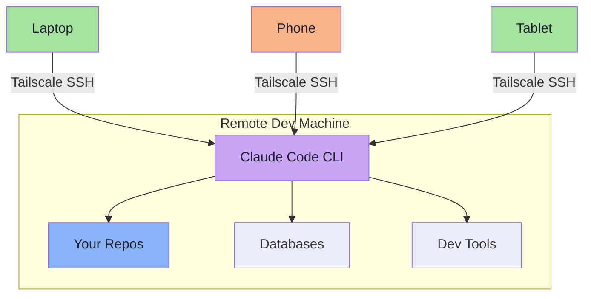

# Step 6: Running Claude Code Remotely

> **Goal:** Install and run Claude Code on your remote dev machine so you can interact with it from anywhere — your laptop, your phone, or any device that can SSH in.

**Prerequisites:** [Step 5: Access from Your Phone](./05-mobile-access.md) completed.

---

## Why Run Claude Code Remotely?

Running Claude Code on a remote machine instead of locally has several advantages:

- **Persistent sessions** — Claude Code runs inside tmux, so conversations and context survive disconnections. Start a long task, disconnect, reconnect hours later, and the output is waiting for you.
- **Powerful hardware** — your dev server may have more CPU, RAM, and faster disk than your laptop. Builds, tests, and file operations are faster.
- **Access from any device** — interact with Claude Code from your phone during a commute, from a tablet on the couch, or from a lightweight Chromebook.
- **Consistent environment** — your dev tools, config files, repos, and database are all on one machine. No syncing between devices.
- **Security** — your code never leaves the server. Tailscale encrypts the connection. No exposed ports.



---

## Install Claude Code

### Prerequisites on the remote machine

Claude Code requires Node.js 18+. Verify:

```bash
node --version
```

If Node.js is not installed or is too old:

```bash
# Install Node.js via nvm (recommended)
curl -o- https://raw.githubusercontent.com/nvm-sh/nvm/v0.40.3/install.sh | bash
source ~/.bashrc
nvm install --lts
```

### Install Claude Code CLI

```bash
npm install -g @anthropic-ai/claude-code
```

Verify the installation:

```bash
claude --version
```

### Authenticate

Run Claude Code for the first time to authenticate:

```bash
claude
```

Follow the on-screen instructions to log in with your Anthropic account. This is a one-time setup — your authentication persists across sessions.

---

## Running Claude Code in tmux

The ideal way to run Claude Code remotely is inside a dedicated tmux window. This way:

- Claude Code survives SSH disconnections
- You can switch between Claude Code and your editor/terminal with a keystroke
- Long-running tasks (code generation, file edits) continue while you are away

### Using dev-session.sh

The [`dev-session.sh`](../../configs/dev-session.sh) script automatically creates a tmux session with a dedicated Claude Code window:

```bash
./dev-session.sh
```

This creates four windows:

| Window | Name | Purpose |
|---|---|---|
| 1 | `claude` | Claude Code CLI (auto-launched) |
| 2 | `code` | Editor (top 70%) + Terminal (bottom 30%) |
| 3 | `server` | Dev server (left) + Logs (right) |
| 4 | `git` | Git operations |

The script auto-launches `claude` in window 1 and focuses on it.

### Manual setup

If you prefer to set things up manually:

```bash
# Start a tmux session
tmux new-session -s dev -n claude

# Launch Claude Code
claude

# Create additional windows as needed
# prefix + c → new window
```

---

## The Perfect tmux Layout for Claude Code

Here is the recommended workflow:

### Window 1: Claude Code (full screen)

Give Claude Code the entire window. It produces long output — code diffs, explanations, multi-file changes — and having full screen space lets you review everything without scrolling.

```
┌───────────────────────────────────────┐
│                                       │
│            Claude Code                │
│                                       │
│  > Help me refactor the auth module   │
│                                       │
│  I'll analyze the current auth...     │
│  [shows code, diffs, explanations]    │
│                                       │
│                                       │
└───────────────────────────────────────┘
```

### Window 2: Code review

After Claude Code makes changes, switch here to review:

```
┌───────────────────────────────────────┐
│  vim src/auth/handler.ts              │
│  (or any editor)                      │
│                                       │
│  Review the changes Claude made       │
│                                       │
├───────────────────────────────────────┤
│  $ git diff                           │
│  $ npm test                           │
└───────────────────────────────────────┘
```

### Window 3: Running services

Keep your dev server and logs visible:

```
┌──────────────────┬────────────────────┐
│  $ npm run dev   │  $ tail -f app.log │
│  Server running  │  [live log output] │
│  on :3000        │                    │
└──────────────────┴────────────────────┘
```

### Switching between windows

```
prefix + 1  →  Claude Code (ask questions, give instructions)
prefix + 2  →  Review changes, run tests
prefix + 3  →  Check server status, read logs
prefix + 4  →  Git operations (commit, push, branch)
```

This switching pattern becomes muscle memory fast. Within a day you will be navigating instinctively.

---

## Tips for Using Claude Code Remotely

### 1. Keep Claude Code in its own window

Do not put Claude Code in a pane alongside other tools. It needs screen width for code blocks and diffs. Use dedicated windows and switch between them.

### 2. Use tmux-resurrect to preserve sessions

If your server reboots, tmux-resurrect (configured in [Step 3](./03-tmux-setup.md)) will restore your window layout. You will need to re-launch Claude Code manually, but your conversation history is preserved by Claude Code itself.

Save your tmux state explicitly before planned reboots:

```
prefix + Ctrl+s    (tmux-resurrect save)
```

After reboot:

```bash
tmux
# tmux-continuum should auto-restore, or manually:
# prefix + Ctrl+r    (tmux-resurrect restore)
```

Then in the `claude` window:

```bash
claude    # Re-launch; Claude Code restores its own conversation state
```

### 3. Use Claude Code's headless mode for long tasks

If you are about to disconnect and want Claude Code to continue working, let it finish its current task. tmux ensures the process keeps running. When you reconnect, scroll up to see the output.

### 4. Set up your project context

Before starting Claude Code, navigate to your project root:

```bash
cd ~/projects/my-app
claude
```

Claude Code reads your project structure, `package.json`, `CLAUDE.md`, and other context files to provide better assistance.

### 5. Multiple projects, multiple sessions

For different projects, use separate tmux sessions:

```bash
./dev-session.sh frontend
./dev-session.sh backend
./dev-session.sh infra
```

Each session gets its own Claude Code instance, windows, and context.

---

## Security Considerations

### What is encrypted

```
Phone/Laptop → [SSH encryption] → [WireGuard encryption] → Dev Machine
```

Your Claude Code session is protected by two layers of encryption:

1. **SSH protocol encryption** — encrypts the terminal session
2. **WireGuard tunnel (Tailscale)** — encrypts all traffic between devices

### No exposed ports

Your dev machine does not expose any ports to the public internet. Tailscale SSH operates entirely within the WireGuard tunnel. An attacker cannot even discover your machine, let alone connect to it.

### Code stays on the server

When you use Claude Code remotely, your code never transfers to your local device. You are just sending keystrokes and receiving terminal output over the encrypted tunnel. This is especially relevant for sensitive codebases.

### Authentication chain

```
Your identity provider (Google/GitHub/etc.)
    → Tailscale authentication
        → Tailscale SSH certificate
            → tmux session on the server
                → Claude Code
```

Every step in this chain is authenticated and encrypted.

---

## Summary

At this point, you should have:

- [x] Claude Code installed on your remote dev machine
- [x] A tmux workflow for running Claude Code in a dedicated window
- [x] The `dev-session.sh` script for quick environment setup
- [x] An understanding of the security model

Your complete setup is now:

```
Tailscale (networking) → SSH (access) → tmux (persistence) → Claude Code (development)
```

You can code from anywhere, on any device, with AI assistance, and never lose your work.

**Next:** [Advanced Tips & Tricks](./07-advanced-tips.md) — power-user configurations, automation, and optimization.
