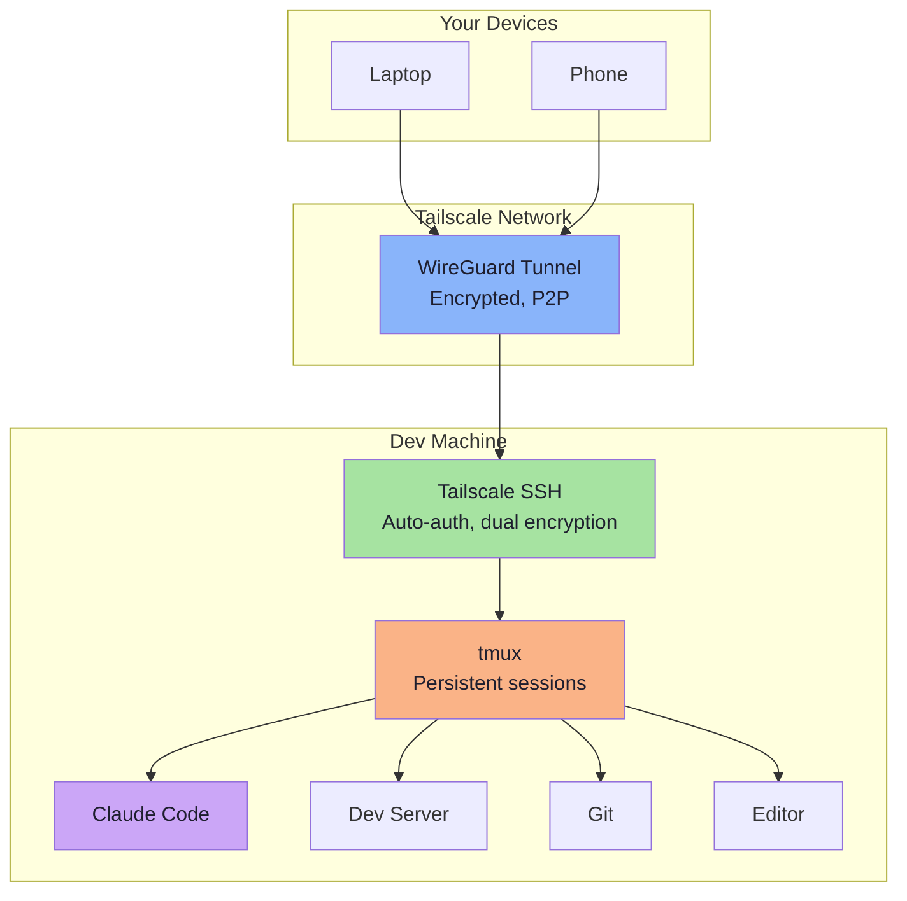

# Advanced Tips & Tricks

> **Goal:** Level up your remote development setup with advanced Tailscale features, tmux automation, SSH optimizations, and performance tuning.

**Prerequisites:** [Steps 1-6](./01-tailscale-setup.md) completed.

---

## Tailscale Advanced Features

### Subnet routing

Access devices on a local network that do not have Tailscale installed. For example, reach a NAS, printer, or internal service through a Tailscale node on the same LAN.

```bash
# On a machine in the target network, advertise the subnet
sudo tailscale up --advertise-routes=192.168.1.0/24

# Approve the route in the admin console (Access Controls > Machines > Edit route settings)
```

Now any device on your tailnet can reach `192.168.1.x` addresses through the advertising node.

### Exit nodes

Route all your internet traffic through a specific device on your tailnet. Useful when you are on an untrusted network (cafe WiFi, airport).

```bash
# On the machine you want to use as an exit node
sudo tailscale up --advertise-exit-node

# On the client, use it
sudo tailscale up --exit-node=dev-machine
```

Your internet traffic now goes through `dev-machine`, encrypted via WireGuard.

### ACL GitOps

Manage your Tailscale ACLs in a Git repository instead of editing them in the admin console. Tailscale supports syncing ACLs from GitHub:

1. Store your ACL file in a GitHub repo
2. In the admin console, go to **Access Controls** > **Use a GitOps workflow**
3. Connect your GitHub repo
4. ACL changes are now deployed via pull requests — with review, history, and rollback

### Session recording

Record SSH sessions for auditing and compliance. Tailscale can send session recordings to an S3-compatible bucket.

In your ACL file:

```jsonc
{
  "ssh": [
    {
      "action": "accept",
      "src": ["autogroup:member"],
      "dst": ["tag:production"],
      "users": ["autogroup:nonroot"],
      "recorder": ["tag:recorder"]
    }
  ]
}
```

Sessions to production machines are recorded. Useful for teams with compliance requirements.

### Tailscale Funnel

Expose a local service to the public internet through Tailscale, without opening ports or configuring DNS:

```bash
# Serve a local dev server publicly
tailscale funnel 3000
```

This gives you a public HTTPS URL (e.g., `https://dev-machine.tail1234.ts.net`) that proxies to your local port 3000. Useful for sharing a preview with someone not on your tailnet.

---

## tmux Advanced Techniques

### Scripting layouts

Create complex layouts programmatically. Beyond `dev-session.sh`, you can script any layout:

```bash
#!/usr/bin/env bash
# Full-stack development layout
SESSION="fullstack"

tmux new-session -d -s "$SESSION" -n "frontend"
tmux send-keys "cd ~/projects/frontend && npm run dev" Enter

tmux split-window -h -t "$SESSION:frontend"
tmux send-keys "cd ~/projects/frontend && npm run test:watch" Enter

tmux new-window -t "$SESSION" -n "backend"
tmux send-keys "cd ~/projects/backend && npm run dev" Enter

tmux split-window -h -t "$SESSION:backend"
tmux send-keys "cd ~/projects/backend && tail -f logs/app.log" Enter

tmux new-window -t "$SESSION" -n "db"
tmux send-keys "psql -h localhost -U dev" Enter

tmux select-window -t "$SESSION:frontend"
exec tmux attach -t "$SESSION"
```

### tmuxinator

For projects where you always need the same layout, [tmuxinator](https://github.com/tmuxinator/tmuxinator) provides YAML-based session configs:

```bash
gem install tmuxinator
```

Create a project config:

```yaml
# ~/.tmuxinator/myapp.yml
name: myapp
root: ~/projects/myapp

windows:
  - claude:
      layout: main-vertical
      panes:
        - claude
  - editor:
      layout: main-horizontal
      panes:
        - vim .
        - # empty terminal
  - server:
      panes:
        - npm run dev
  - tests:
      panes:
        - npm run test:watch
```

Launch with:

```bash
tmuxinator start myapp
```

### Custom key bindings

Add project-specific bindings to your `.tmux.conf`:

```bash
# Quick access to common directories
bind P split-window -h -c "~/projects"
bind G new-window -n "lazygit" "lazygit"

# Toggle between two layouts
bind M-1 select-layout main-horizontal
bind M-2 select-layout main-vertical
bind M-3 select-layout tiled

# Send command to a specific pane
bind R send-keys -t 2 "npm run dev" Enter
```

### Nested tmux sessions

When you SSH from one tmux session into another machine running tmux, the prefix key conflicts. The solution is to use a different prefix for the inner session, or toggle the outer prefix off.

Add to `.tmux.conf`:

```bash
# Toggle outer tmux prefix off/on with F12
# When off, all keys pass through to the inner tmux
bind -T root F12 \
    set prefix None \;\
    set key-table off \;\
    set status-style "bg=#6c7086,fg=#1e1e2e" \;\
    if -F '#{pane_in_mode}' 'send-keys -X cancel' \;\
    refresh-client -S

bind -T off F12 \
    set -u prefix \;\
    set -u key-table \;\
    set -u status-style \;\
    refresh-client -S
```

Press `F12` to toggle: outer tmux becomes transparent, inner tmux receives all commands. The status bar color changes to indicate which tmux is active.

---

## SSH Advanced Techniques

### Agent forwarding over Tailscale

Forward your SSH agent to the remote machine so you can use your local SSH keys (e.g., for GitHub) without copying private keys to the server:

```bash
ssh -A user@dev-machine
```

Or add to `~/.ssh/config`:

```
Host dev-machine
    ForwardAgent yes
```

> **Security note:** Only forward your agent to machines you trust. The remote machine's root user can use your forwarded agent.

### Port forwarding

Access a service running on the remote machine as if it were local:

```bash
# Forward remote port 3000 to local port 3000
ssh -L 3000:localhost:3000 user@dev-machine

# Forward remote port 5432 (PostgreSQL) to local port 5433
ssh -L 5433:localhost:5432 user@dev-machine
```

This is useful for accessing web UIs or databases on the remote machine from your local browser.

> **Note:** With Tailscale, you can often access remote services directly by IP (e.g., `http://100.64.0.1:3000`). Port forwarding is mainly useful when the service is bound to `localhost` on the remote machine.

### ProxyJump (bastion host)

If you have a machine that is only reachable through another machine:

```bash
ssh -J jump-host user@internal-machine
```

Or in `~/.ssh/config`:

```
Host internal
    HostName internal-machine
    User developer
    ProxyJump jump-host
```

With Tailscale, you rarely need this since all devices can reach each other directly. But it is useful in hybrid setups where some machines are on Tailscale and others are not.

### Persistent SSH connections

Keep SSH connections alive and reuse them:

```
# ~/.ssh/config
Host *
    ServerAliveInterval 60
    ServerAliveCountMax 3
    ControlMaster auto
    ControlPath ~/.ssh/sockets/%r@%h-%p
    ControlPersist 600
```

```bash
mkdir -p ~/.ssh/sockets
```

- `ServerAliveInterval` — send a keepalive every 60 seconds
- `ControlMaster/ControlPath` — reuse connections (second SSH to the same host connects instantly)
- `ControlPersist 600` — keep the master connection open for 10 minutes after the last session

---

## Performance Optimization

### Reducing latency

For the lowest latency SSH experience:

```
# ~/.ssh/config
Host dev-machine
    Compression no          # Don't compress (Tailscale already compresses)
    Ciphers aes128-gcm@openssh.com   # Fastest cipher
```

> Tailscale already encrypts traffic with WireGuard. SSH encryption on top is a second layer. Using a fast cipher minimizes the overhead of that second layer.

### Optimizing for slow connections

When on a slow mobile connection:

```bash
# Use mosh instead of SSH for better latency handling
# Install on both machines
sudo apt install mosh    # or: brew install mosh

# Connect
mosh user@dev-machine -- tmux attach -t dev
```

Mosh handles high latency and packet loss better than SSH. It shows local echo immediately and syncs state asynchronously.

If you cannot use mosh, optimize your tmux for slow connections:

```bash
# In .tmux.conf — reduce status bar updates
set -g status-interval 30    # Update every 30s instead of 5s

# Reduce visual effects
set -g visual-activity off
set -g visual-bell off
```

### Reducing tmux rendering overhead

If you notice lag in tmux (especially with complex prompts or fast-scrolling output):

```bash
# Limit the rate at which tmux redraws
set -g c0-change-interval 100
set -g c0-change-trigger 250
```

---

## Automation

### Auto-start tmux on SSH login

Add this to `~/.bashrc` or `~/.zshrc` on your dev machine:

```bash
# Auto-attach to tmux on SSH login
if [[ -n "$SSH_CONNECTION" ]] && [[ -z "$TMUX" ]]; then
    tmux attach -t dev 2>/dev/null || tmux new-session -s dev
fi
```

This means: if you connected via SSH and are not already inside tmux, auto-attach to the `dev` session (or create it). Now every SSH login drops you straight into tmux.

> **Caveat:** If you need a bare SSH session without tmux (e.g., for SCP or port forwarding), use: `ssh user@dev-machine -t "bash --norc"`

### Auto-start dev services

Extend `dev-session.sh` to start your services automatically:

```bash
# In the server window, auto-start the dev server
tmux send-keys -t "$SESSION:server.1" "npm run dev" Enter

# In the server window right pane, tail logs
tmux send-keys -t "$SESSION:server.2" "tail -f logs/app.log" Enter
```

### Monitoring in the status bar

Display system information in the tmux status bar:

```bash
# CPU and memory usage
set -g status-right "#[fg=#fab387]CPU: #(top -bn1 | grep 'Cpu' | awk '{print $2}')%% #[fg=#a6e3a1]MEM: #(free -m | awk 'NR==2{printf \"%.0f%%\", $3*100/$2}') #[fg=#89b4fa,bold] %H:%M "

# Git branch in status bar
set -g status-right "#[fg=#cba6f7]#(cd #{pane_current_path} && git branch --show-current 2>/dev/null) #[fg=#89b4fa,bold] %H:%M "
```

> **Performance note:** External commands in the status bar run every `status-interval` seconds. Keep them lightweight.

---

## Popular tmux Themes

If you want a different look than the Catppuccin Mocha theme in our config:

### Catppuccin (official plugin)

```bash
# In .tmux.conf
set -g @plugin 'catppuccin/tmux'
set -g @catppuccin_flavor 'mocha'    # or: latte, frappe, macchiato
```

### Dracula

```bash
set -g @plugin 'dracula/tmux'
set -g @dracula-plugins "cpu-usage ram-usage time"
set -g @dracula-show-powerline true
```

### Nord

```bash
set -g @plugin 'arcticicestudio/nord-tmux'
```

### Tokyo Night

```bash
set -g @plugin 'janoamaral/tokyo-night-tmux'
```

Install any of these with TPM (`prefix + I`).

---

## Putting It All Together

Here is the complete stack, optimized for remote development:



### Quick reference: daily workflow

```bash
# From any device, anywhere in the world:

# 1. Connect
ssh user@dev-machine

# 2. You are in tmux (auto-attach from .bashrc)

# 3. Work
prefix + 1  →  Claude Code
prefix + 2  →  Editor
prefix + 3  →  Server
prefix + 4  →  Git

# 4. Leave (close laptop, switch devices, lose WiFi — it does not matter)

# 5. Come back from any device
ssh user@dev-machine
# Everything is exactly as you left it.
```

---

## Further Reading

- [Tailscale documentation](https://tailscale.com/kb/) — comprehensive official docs
- [Tailscale SSH docs](https://tailscale.com/kb/1193/tailscale-ssh/) — deep dive on Tailscale SSH
- [tmux manual](https://man.openbsd.org/tmux.1) — the complete reference
- [tmux cheat sheet](https://tmuxcheatsheet.com/) — visual quick reference
- [Claude Code documentation](https://docs.anthropic.com/en/docs/claude-code) — official Claude Code docs
- [WireGuard whitepaper](https://www.wireguard.com/papers/wireguard.pdf) — understand the encryption layer

---

**You have completed the guide.** You now have a professional remote development environment that lets you code from anywhere, on any device, with persistent sessions and AI-powered assistance. Go build something great.
