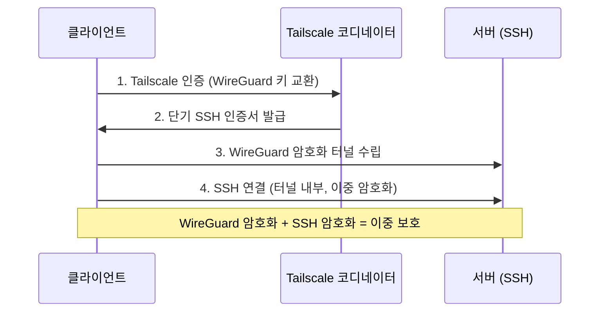

# Step 2: Tailscale SSH 설정

> **소요 시간:** 10~15분  
> **난이도:** 초급~중급  
> **사전 준비:** [Step 1: Tailscale 설치 및 설정](./01-tailscale-setup.md) 완료

---

## Tailscale SSH란?

Tailscale SSH는 기존의 SSH 키 관리를 완전히 대체하는 기능입니다. SSH 키를 생성하거나, 배포하거나, 관리할 필요가 없습니다. Tailscale이 **모든 것을 자동으로** 처리합니다.

```
❌ 기존 SSH:
   1. ssh-keygen으로 키 쌍 생성
   2. 공개키를 서버에 복사 (ssh-copy-id)
   3. ~/.ssh/authorized_keys 관리
   4. 키 만료 시 교체
   5. 기기마다 반복...

✅ Tailscale SSH:
   1. tailscale set --ssh    ← 끝!
```

## 동작 원리

Tailscale SSH는 **이중 암호화** 구조로 동작합니다.



| 계층 | 프로토콜 | 역할 |
|------|----------|------|
| 외부 | WireGuard | 네트워크 레벨 암호화, NAT 통과 |
| 내부 | SSH | 애플리케이션 레벨 인증 및 암호화 |

핵심 포인트는 다음과 같습니다.

- **자동 키 관리:** Tailscale이 단기(short-lived) SSH 인증서를 자동으로 발급하고 갱신합니다.
- **키 배포 불필요:** `ssh-copy-id`, `authorized_keys` 설정이 전혀 필요 없습니다.
- **중앙 접근 제어:** 관리 콘솔의 ACL(Access Control List)로 "누가 어디에 접속할 수 있는지"를 한 곳에서 관리합니다.

---

## SSH 서버 활성화

원격 접속을 **받을** 서버(개발 머신)에서 Tailscale SSH 서버를 활성화합니다.

```bash
# 개발 서버에서 실행
sudo tailscale set --ssh
```

이것만으로 끝입니다. 서버가 이제 Tailscale SSH 연결을 수락합니다.

> **확인 방법:**
> ```bash
> tailscale status --self
> ```
> 출력에 `SSH: yes`가 표시되면 정상입니다.

---

## ACL 설정 (접근 제어)

Tailscale 관리 콘솔에서 SSH 접근 규칙을 설정합니다. ACL은 JSON 형식으로 작성합니다.

### 관리 콘솔 접속

1. [https://login.tailscale.com/admin/acls](https://login.tailscale.com/admin/acls)에 접속합니다.
2. **Access Controls** 탭에서 SSH 규칙을 추가합니다.

### 기본 ACL 구조

```jsonc
{
  "ssh": [
    {
      "action": "accept",      // 접속 허용
      "src":    ["autogroup:members"], // 누가
      "dst":    ["autogroup:self"],    // 어디에
      "users":  ["autogroup:nonroot"]  // 어떤 사용자로
    }
  ]
}
```

### 일반적인 ACL 패턴

#### 패턴 1: 개인 사용 (모든 기기에서 모든 기기로)

가장 간단한 설정입니다. 내 계정의 모든 기기에서 모든 기기로 SSH 접속을 허용합니다.

```jsonc
{
  "ssh": [
    {
      "action": "accept",
      "src":    ["autogroup:members"],
      "dst":    ["autogroup:self"],
      "users":  ["autogroup:nonroot"]
    }
  ]
}
```

#### 패턴 2: 팀 환경 (태그 기반 접근 제어)

서버에 태그를 붙여서 역할별로 접근을 제어합니다.

```jsonc
{
  "tagOwners": {
    "tag:dev-server": ["group:developers"],
    "tag:production": ["group:sre"]
  },
  "ssh": [
    {
      // 개발자는 dev-server 태그가 붙은 서버에 접속 가능
      "action": "accept",
      "src":    ["group:developers"],
      "dst":    ["tag:dev-server"],
      "users":  ["developer"]
    },
    {
      // SRE만 프로덕션 서버에 접속 가능
      "action": "accept",
      "src":    ["group:sre"],
      "dst":    ["tag:production"],
      "users":  ["ubuntu", "ec2-user"]
    }
  ]
}
```

#### 패턴 3: root 접근 시 재인증 요구

보안이 중요한 환경에서는 root 접근 시 추가 인증을 요구할 수 있습니다.

```jsonc
{
  "ssh": [
    {
      // 일반 접속은 허용
      "action": "accept",
      "src":    ["autogroup:members"],
      "dst":    ["autogroup:self"],
      "users":  ["autogroup:nonroot"]
    },
    {
      // root 접속 시 12시간마다 재인증
      "action": "check",
      "src":    ["autogroup:members"],
      "dst":    ["autogroup:self"],
      "users":  ["root"],
      "checkPeriod": "12h"
    }
  ]
}
```

> **`action` 옵션 설명:**
> - `accept`: 즉시 허용 (추가 인증 없음)
> - `check`: Tailscale 웹에서 재인증 후 허용 (민감한 접근에 적합)
> - `deny`: 완전 차단 (명시적 거부가 필요할 때)

---

## 연결 테스트

다른 기기(노트북, 폰 등)에서 개발 서버에 접속합니다.

```bash
# MagicDNS 이름으로 접속
ssh user@dev-server

# 또는 Tailscale IP로 접속
ssh user@100.64.0.2
```

정상적으로 연결되면 비밀번호 입력 없이 바로 셸이 열립니다.

### 예상 출력

```
$ ssh hyun@dev-server
Welcome to Ubuntu 24.04 LTS (GNU/Linux 6.8.0-45-generic x86_64)

Last login: Mon Apr  7 10:30:00 2026 from 100.64.0.1
hyun@dev-server:~$
```

> **팁:** 처음 연결할 때 "The authenticity of host ... can't be established" 메시지가 나올 수 있습니다. `yes`를 입력하면 됩니다. Tailscale SSH를 사용하는 경우 이 확인은 한 번만 필요합니다.

---

## 기존 SSH 비활성화 (보안 강화)

Tailscale SSH가 잘 동작하면, 기존의 공개 SSH 포트(22번)를 닫아서 보안을 강화할 수 있습니다.

### 방화벽에서 포트 22 닫기

#### UFW (Ubuntu/Debian)

```bash
# 현재 규칙 확인
sudo ufw status

# SSH 포트 차단
sudo ufw deny 22/tcp

# 또는 기존 SSH 허용 규칙 삭제
sudo ufw delete allow ssh
```

#### firewalld (RHEL/CentOS/Fedora)

```bash
sudo firewall-cmd --remove-service=ssh --permanent
sudo firewall-cmd --reload
```

#### iptables

```bash
sudo iptables -A INPUT -p tcp --dport 22 -j DROP
```

> **주의:** 포트 22를 닫기 전에 반드시 Tailscale SSH로 접속이 되는지 **먼저** 확인하세요. 그렇지 않으면 서버에 접속할 수 없게 됩니다!

### SSH 데몬 비활성화 (선택사항)

Tailscale SSH만 사용할 거라면 SSH 데몬 자체를 끌 수도 있습니다.

```bash
# SSH 데몬 중지 및 비활성화
sudo systemctl stop sshd
sudo systemctl disable sshd
```

> **경고:** 이렇게 하면 Tailscale이 아닌 일반 SSH 접속이 완전히 차단됩니다. 비상시 서버에 물리적으로 접근할 수 있는 경우에만 진행하세요.

---

## 보안 모범 사례

### 1. 최소 권한 원칙

필요한 사용자에게 필요한 서버만 접근을 허용하세요.

```jsonc
// 좋은 예: 구체적인 접근 규칙
{
  "ssh": [
    {
      "action": "accept",
      "src": ["user@gmail.com"],
      "dst": ["tag:dev-server"],
      "users": ["developer"]
    }
  ]
}
```

### 2. 세션 레코딩 활성화

Tailscale은 SSH 세션을 녹화할 수 있습니다. 팀 환경에서 감사(audit) 로그가 필요할 때 유용합니다.

```jsonc
{
  "ssh": [
    {
      "action": "accept",
      "src": ["group:developers"],
      "dst": ["tag:production"],
      "users": ["ubuntu"],
      "recorder": ["tag:recorder"]
    }
  ]
}
```

### 3. 키 만료 설정

관리 콘솔에서 기기 키 만료를 설정하면, 일정 기간이 지나면 재인증을 요구합니다.

### 4. 2FA/MFA 활성화

Tailscale 계정에 2단계 인증을 설정하면 SSH 접근의 보안이 더 강화됩니다. Tailscale 계정이 탈취되지 않는 한 SSH 접근도 안전합니다.

---

## SSH 설정 간소화 (~/.ssh/config)

Tailscale SSH를 사용하더라도 `~/.ssh/config`에 호스트를 등록해 두면 더 편리합니다.

```ssh-config
# ~/.ssh/config
Host dev
    HostName dev-server           # MagicDNS 이름
    User hyun
    # Tailscale SSH가 인증을 처리하므로 IdentityFile 불필요

Host dev-ip
    HostName 100.64.0.2          # Tailscale IP (MagicDNS 안 될 때 대비)
    User hyun
```

이제 간단히 접속할 수 있습니다.

```bash
ssh dev
```

---

## 문제 해결

| 증상 | 해결 방법 |
|------|-----------|
| "Connection refused" | 서버에서 `sudo tailscale set --ssh`가 실행되었는지 확인하세요. |
| "Permission denied" | ACL에서 해당 사용자/기기가 허용되어 있는지 [관리 콘솔](https://login.tailscale.com/admin/acls)에서 확인하세요. |
| 접속이 매우 느림 | `tailscale ping dev-server`로 직접 연결인지 DERP 릴레이인지 확인하세요. |
| macOS에서 SSH 서버가 안 됨 | App Store 버전이 아닌 독립형/CLI 버전을 사용하고 있는지 확인하세요 ([Step 1 참고](./01-tailscale-setup.md#macos-변형-비교)). |

---

## 다음 단계

Tailscale SSH로 어디서든 안전하게 개발 서버에 접속할 수 있게 되었습니다. 하지만 SSH 연결이 끊기면 실행 중이던 작업이 모두 사라집니다. 다음 단계에서 tmux를 설정하여 **연결이 끊겨도 작업이 유지되는** 환경을 만들어 보겠습니다.

> **다음:** [Step 3: tmux 설치 및 설정](./03-tmux-setup.md)
