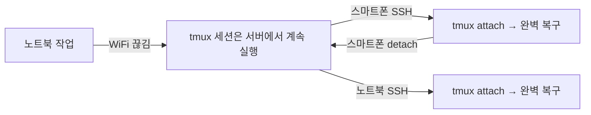

# Step 4: tmux 패인 & 워크플로우 마스터

> **소요 시간:** 20~30분 (실습 포함)  
> **난이도:** 중급  
> **사전 준비:** [Step 3: tmux 설치 및 설정](./03-tmux-setup.md) 완료

---

## 패인(Pane) 관리 치트시트

패인은 윈도우를 분할한 영역입니다. 가장 자주 쓰는 기능이므로 꼭 익혀 두세요.

### 분할

| 단축키 | 동작 | 설명 |
|--------|------|------|
| `prefix + \|` | 좌우 분할 | 현재 패인을 세로로 나눕니다 |
| `prefix + -` | 상하 분할 | 현재 패인을 가로로 나눕니다 |

```
좌우 분할 (prefix + |)          상하 분할 (prefix + -)

┌─────────┬─────────┐          ┌───────────────────┐
│         │         │          │                   │
│  기존    │  새 패인 │          │     기존           │
│         │         │          │                   │
│         │         │          ├───────────────────┤
│         │         │          │     새 패인         │
│         │         │          │                   │
└─────────┴─────────┘          └───────────────────┘
```

### 이동

| 단축키 | 동작 |
|--------|------|
| `Alt + Left` | 왼쪽 패인으로 이동 |
| `Alt + Right` | 오른쪽 패인으로 이동 |
| `Alt + Up` | 위 패인으로 이동 |
| `Alt + Down` | 아래 패인으로 이동 |
| `prefix + q` | 패인 번호 표시 → 번호 입력으로 이동 |

> **팁:** `Alt + 방향키`는 prefix 없이 바로 동작합니다. 패인 간 이동이 매우 빠릅니다.

### 크기 조정

| 단축키 | 동작 |
|--------|------|
| `prefix + Ctrl + 방향키` | 5셀씩 크기 조정 |
| `prefix + Shift + 방향키` | 1셀씩 세밀한 크기 조정 |
| 마우스 드래그 | 패인 경계를 드래그해서 조정 |

### 줌 (Zoom)

```
prefix + z  →  현재 패인을 전체 화면으로 확대/축소 토글
```

줌은 특히 모바일에서 유용합니다. 작은 화면에서 한 패인에 집중해야 할 때 `prefix + z`로 확대하고, 다른 패인을 봐야 할 때 다시 `prefix + z`로 축소합니다.

```
일반 상태:                       줌 상태 (prefix + z):

┌──────────┬──────────┐          ┌──────────────────────┐
│  패인 1   │  패인 2  │          │                      │
│          │          │   ──►   │       패인 1 (확대)    │
│          │          │          │                      │
├──────────┴──────────┤          │                      │
│      패인 3          │          │                      │
└─────────────────────┘          └──────────────────────┘
```

### 기타 패인 조작

| 단축키 | 동작 |
|--------|------|
| `prefix + x` | 현재 패인 닫기 (확인 프롬프트) |
| `prefix + !` | 현재 패인을 새 윈도우로 분리 |
| `prefix + {` | 현재 패인을 이전 위치로 이동 |
| `prefix + }` | 현재 패인을 다음 위치로 이동 |
| `prefix + Space` | 패인 레이아웃을 순환 변경 |

---

## 윈도우(Window) 관리 치트시트

윈도우는 브라우저의 탭과 같습니다.

| 단축키 | 동작 |
|--------|------|
| `prefix + c` | 새 윈도우 생성 |
| `prefix + ,` | 현재 윈도우 이름 변경 |
| `prefix + n` | 다음 윈도우 |
| `prefix + p` | 이전 윈도우 |
| `prefix + 0~9` | 번호로 윈도우 이동 |
| `prefix + w` | 윈도우 목록 (인터랙티브 선택) |
| `prefix + &` | 현재 윈도우 닫기 (확인 프롬프트) |

> **팁:** `prefix + w`는 모든 세션의 윈도우를 트리 형태로 보여줍니다. 세션 간 이동도 가능합니다.

```
prefix + w 화면:

(0) dev: 4 windows
    (0) > 1: claude (1 panes) "dev-server"
    (1)   2: code (2 panes) "dev-server"
    (2)   3: server (2 panes) "dev-server"
    (3)   4: git (1 panes) "dev-server"
(1) work: 2 windows
    (4)   1: email (1 panes) "dev-server"
    (5)   2: docs (1 panes) "dev-server"
```

---

## 세션(Session) 관리

세션은 프로젝트별 작업 공간입니다.

### 생성

```bash
# 새 세션 만들기
tmux new-session -s project-name

# 백그라운드에서 세션 만들기 (접속하지 않음)
tmux new-session -d -s background-task
```

### 분리 (Detach)

```
prefix + d    → 현재 세션에서 빠져나오기
```

세션은 서버에서 계속 실행됩니다. SSH 연결이 끊겨도 마찬가지입니다.

### 재접속 (Attach)

```bash
# 마지막 세션에 재접속
tmux attach

# 축약형
tmux a

# 특정 세션에 재접속
tmux attach -t project-name
tmux a -t project-name
```

### 목록 확인

```bash
tmux list-sessions

# 축약형
tmux ls
```

예상 출력:

```
dev: 4 windows (created Mon Apr  7 10:30:00 2026)
work: 2 windows (created Mon Apr  7 11:00:00 2026)
```

### 세션 종료

```bash
# 특정 세션 종료
tmux kill-session -t session-name

# 현재 세션 제외 모든 세션 종료
tmux kill-session -a

# 모든 세션 종료 (tmux 서버 종료)
tmux kill-server
```

### 세션 간 이동

| 단축키 | 동작 |
|--------|------|
| `prefix + (` | 이전 세션 |
| `prefix + )` | 다음 세션 |
| `prefix + s` | 세션 목록 (인터랙티브 선택) |

---

## 킬러 워크플로우: SSH 연결 끊김 → 재접속

이것이 이 가이드의 **핵심 가치**입니다. 실제 시나리오를 따라해 보세요.

### 시나리오

```
1. 노트북에서 SSH 접속 → tmux 세션 시작 → 코드 작업 중
2. 카페에서 와이파이가 끊김 (또는 노트북 닫음)
3. 스마트폰으로 SSH 재접속
4. tmux 세션 재접속 → 모든 것이 그대로!
5. 집에 돌아와서 노트북으로 다시 접속
6. tmux 세션 재접속 → 여전히 그대로!
```

### 단계별 실습

```bash
# === 1단계: 노트북에서 접속 ===
ssh user@dev-server
tmux new -s dev

# 에디터 열기, 서버 실행 등 작업 시작
vim main.ts          # Window 1
# prefix + c → 새 윈도우
npm run dev          # Window 2

# === 2단계: 연결 끊김 (와이파이 끊김, 노트북 닫음) ===
# (아무것도 할 필요 없음 — tmux 세션은 서버에서 계속 실행)

# === 3단계: 어떤 기기에서든 재접속 ===
ssh user@dev-server
tmux attach -t dev
# → vim이 열려 있고, 서버가 돌아가고 있고, 모든 것이 그대로!
```



---

## dev-session.sh로 미리 정의된 레이아웃

매번 수동으로 윈도우와 패인을 만드는 것은 비효율적입니다. 이 가이드에서 제공하는 [`configs/dev-session.sh`](../../configs/dev-session.sh) 스크립트를 사용하면 한 번에 완벽한 개발 환경이 만들어집니다.

```bash
# 사용법
./dev-session.sh              # "dev" 세션 생성 (또는 기존 세션 재접속)
./dev-session.sh my-project   # "my-project" 세션 생성
```

### 스크립트가 만드는 레이아웃

```
┌─────────────────────────────────────────────────────────────┐
│  Window 1: claude                                           │
│  ┌─────────────────────────────────────────────────────────┐│
│  │                                                         ││
│  │  $ claude                                               ││
│  │  (Claude Code CLI가 실행됨)                               ││
│  │                                                         ││
│  └─────────────────────────────────────────────────────────┘│
├─────────────────────────────────────────────────────────────┤
│  Window 2: code                                             │
│  ┌─────────────────────────────────────────────────────────┐│
│  │  Pane 1 (70%): 에디터 영역                                ││
│  │                                                         ││
│  ├─────────────────────────────────────────────────────────┤│
│  │  Pane 2 (30%): 터미널                                    ││
│  └─────────────────────────────────────────────────────────┘│
├─────────────────────────────────────────────────────────────┤
│  Window 3: server                                           │
│  ┌───────────────────────┬─────────────────────────────────┐│
│  │  Pane 1 (50%): 서버   │  Pane 2 (50%): 로그             ││
│  │                       │                                 ││
│  └───────────────────────┴─────────────────────────────────┘│
├─────────────────────────────────────────────────────────────┤
│  Window 4: git                                              │
│  ┌─────────────────────────────────────────────────────────┐│
│  │  $ git status / git log / etc.                          ││
│  └─────────────────────────────────────────────────────────┘│
└─────────────────────────────────────────────────────────────┘
```

### 스크립트의 핵심 특성

- **멱등성(Idempotent):** 이미 세션이 존재하면 새로 만들지 않고 재접속합니다.
- **자동 레이아웃:** 4개의 윈도우가 미리 구성됩니다.
- **Claude Code 전용 윈도우:** 첫 번째 윈도우에서 Claude Code가 자동 실행됩니다.

---

## tmux에서 Claude Code 사용하기

Claude Code CLI는 tmux와 완벽하게 호환됩니다.

### 기본 사용법

```bash
# tmux 세션 안에서 Claude Code 실행
claude
```

### 권장 워크플로우

```
Window 1: claude    → Claude Code CLI (대화, 코드 리뷰, 디버깅)
Window 2: code      → 에디터 + 터미널 (코드 편집, 테스트 실행)
Window 3: server    → 개발 서버 + 로그 (실시간 결과 확인)
Window 4: git       → 버전 관리 (commit, push, PR)
```

윈도우 간 이동은 `prefix + 번호`로 즉시 전환합니다.

```
prefix + 1  → Claude Code로 이동
prefix + 2  → 에디터로 이동
prefix + 3  → 서버 로그 확인
prefix + 4  → git 작업
```

---

## 멀티 패인 개발 레이아웃

프로젝트 특성에 따라 다양한 레이아웃을 구성할 수 있습니다.

### 풀스택 개발 레이아웃

```
┌─────────────────────────────┬──────────────────────────────┐
│                             │                              │
│  Claude Code                │   에디터 (Vim/Neovim)         │
│  (코드 생성/리뷰)             │                              │
│                             │                              │
├─────────────────────────────┼──────────────────────────────┤
│                             │                              │
│  프론트엔드 서버               │   백엔드 서버                  │
│  (npm run dev)              │   (npm run server)           │
│                             │                              │
└─────────────────────────────┴──────────────────────────────┘
```

만드는 방법:

```bash
# 1. 좌우 분할
prefix + |

# 2. 왼쪽 패인에서 상하 분할
Alt + Left
prefix + -

# 3. 오른쪽 패인에서 상하 분할
Alt + Right
prefix + -
```

### 모니터링 레이아웃

```
┌───────────────────────────────────────────────────────────────┐
│                                                               │
│                  메인 작업 영역 (Claude Code)                    │
│                                                               │
├────────────────────┬────────────────────┬─────────────────────┤
│  서버 로그          │  테스트 실행         │  git 상태            │
│  tail -f log       │  npm test --watch  │  git log --oneline  │
└────────────────────┴────────────────────┴─────────────────────┘
```

---

## 복사 모드와 스크롤백

tmux에서 스크롤하거나 텍스트를 복사하려면 **복사 모드**에 진입해야 합니다.

### 복사 모드 진입/탈출

| 방법 | 단축키 |
|------|--------|
| 진입 | `prefix + v` 또는 `prefix + [` |
| 탈출 | `q` 또는 `Esc` |
| 마우스 스크롤 | 자동으로 복사 모드 진입 |

### 복사 모드 내 조작 (Vi 키 바인딩)

| 키 | 동작 |
|----|------|
| `j`, `k` | 한 줄씩 위/아래 이동 |
| `Ctrl-u`, `Ctrl-d` | 반 페이지씩 위/아래 이동 |
| `g` | 버퍼 맨 위 |
| `G` | 버퍼 맨 아래 |
| `/` | 앞으로 검색 |
| `?` | 뒤로 검색 |
| `n` | 다음 검색 결과 |
| `N` | 이전 검색 결과 |
| `v` | 선택 시작 |
| `y` | 선택 영역 복사 (클립보드) |

### 텍스트 복사 실습

```
1. prefix + v      → 복사 모드 진입
2. 방향키로 이동     → 복사할 위치로
3. v               → 선택 시작
4. 방향키로 범위 지정 → 복사할 범위를 선택
5. y               → 복사 (자동으로 복사 모드 탈출)
6. prefix + ]      → 붙여넣기
```

> **팁:** `tmux-yank` 플러그인이 설치되어 있으면 `y`로 복사한 텍스트가 시스템 클립보드에도 들어갑니다. 로컬 에디터에 바로 붙여넣기(`Cmd+V` / `Ctrl+V`)할 수 있습니다.

---

## 키 바인딩 전체 참조

### Prefix 키: `Ctrl-a`

모든 tmux 명령은 먼저 `Ctrl-a`를 누르고, 손을 뗀 후, 해당 키를 누릅니다.

### 세션

| 단축키 | 동작 |
|--------|------|
| `prefix + d` | 세션 분리 (detach) |
| `prefix + s` | 세션 목록 |
| `prefix + (` | 이전 세션 |
| `prefix + )` | 다음 세션 |
| `prefix + $` | 세션 이름 변경 |

### 윈도우

| 단축키 | 동작 |
|--------|------|
| `prefix + c` | 새 윈도우 |
| `prefix + ,` | 윈도우 이름 변경 |
| `prefix + n` | 다음 윈도우 |
| `prefix + p` | 이전 윈도우 |
| `prefix + 0~9` | 번호로 이동 |
| `prefix + w` | 윈도우/세션 트리 |
| `prefix + &` | 윈도우 닫기 |

### 패인

| 단축키 | 동작 |
|--------|------|
| `prefix + \|` | 좌우 분할 |
| `prefix + -` | 상하 분할 |
| `Alt + 방향키` | 패인 이동 (prefix 불필요) |
| `prefix + Ctrl + 방향키` | 크기 조정 (5셀) |
| `prefix + Shift + 방향키` | 크기 조정 (1셀) |
| `prefix + z` | 줌 토글 |
| `prefix + x` | 패인 닫기 |
| `prefix + !` | 패인 → 윈도우 |
| `prefix + q` | 패인 번호 표시 |
| `prefix + Space` | 레이아웃 순환 |

### 복사 모드

| 단축키 | 동작 |
|--------|------|
| `prefix + v` / `prefix + [` | 복사 모드 진입 |
| `v` | 선택 시작 |
| `Ctrl-v` | 사각형 선택 토글 |
| `y` | 복사 |
| `q` / `Esc` | 복사 모드 탈출 |
| `prefix + ]` | 붙여넣기 |

### 기타

| 단축키 | 동작 |
|--------|------|
| `prefix + r` | 설정 리로드 |
| `prefix + I` | TPM 플러그인 설치 |
| `prefix + U` | TPM 플러그인 업데이트 |
| `prefix + Ctrl-s` | 세션 저장 (resurrect) |
| `prefix + Ctrl-r` | 세션 복원 (resurrect) |

---

## 다음 단계

tmux의 핵심 워크플로우를 익혔습니다. 이제 진짜 재미있는 부분으로 넘어갑니다. 핸드폰에서 개발 서버에 접속하는 방법을 알아봅니다.

> **다음:** [Step 5: 핸드폰에서 접속하기](./05-mobile-access.md)
