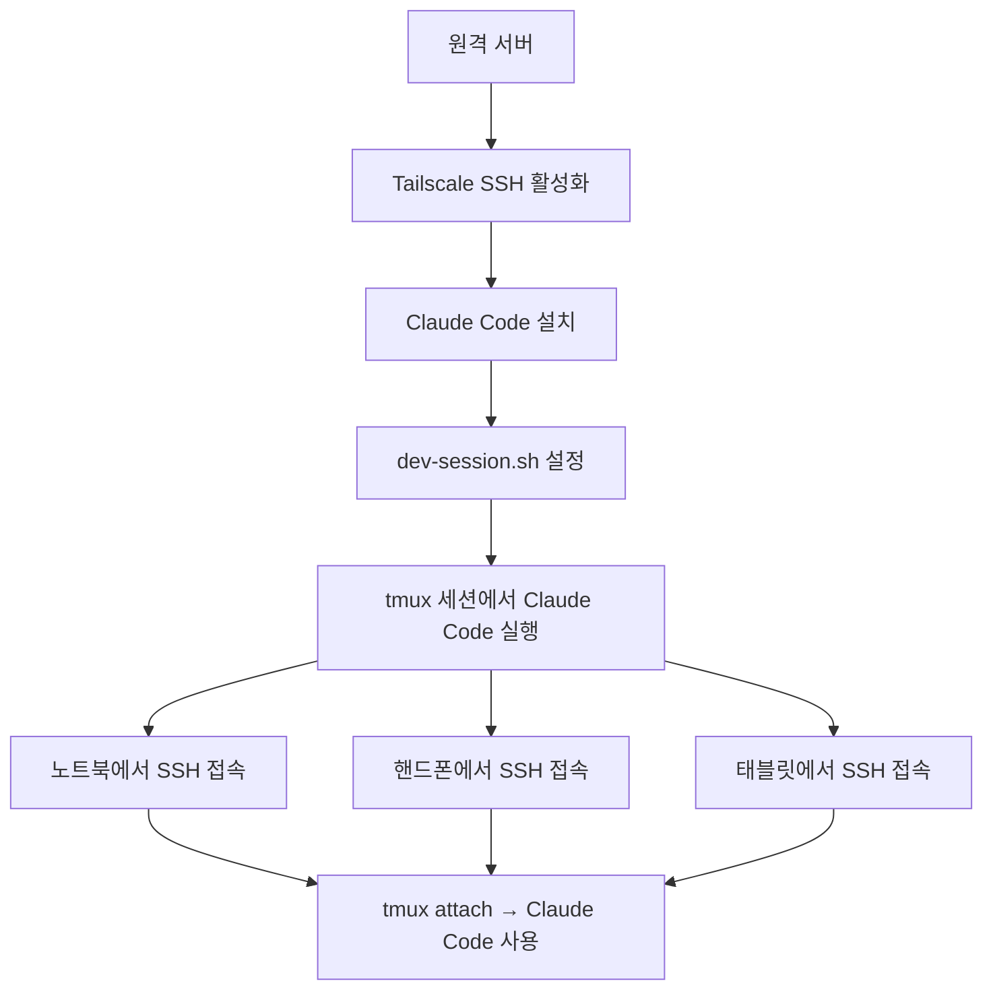

# Step 6: Claude Code 원격 실행

> **소요 시간:** 10~15분  
> **난이도:** 초급~중급  
> **사전 준비:** [Step 1~5](./01-tailscale-setup.md) 완료, Anthropic API 키 또는 Claude Pro/Max 구독

---

## 왜 원격 서버에서 Claude Code를 실행하나?

Claude Code를 원격 개발 서버에서 실행하면 여러 가지 장점이 있습니다.

| 장점 | 설명 |
|------|------|
| **강력한 하드웨어** | 서버의 CPU, 메모리, SSD를 활용합니다. 노트북 배터리를 소모하지 않습니다. |
| **어디서나 접근** | Tailscale + tmux 덕분에 어떤 기기에서든 같은 Claude Code 세션에 접속할 수 있습니다. |
| **항상 실행** | 노트북을 닫아도 Claude Code가 서버에서 계속 돌아갑니다. 긴 작업도 끊기지 않습니다. |
| **빠른 코드 접근** | 코드가 서버에 있으므로 Claude Code가 파일을 읽고 쓰는 속도가 빠릅니다. |
| **동일한 환경** | 개발 환경(Node.js, Python, Docker 등)이 서버에 고정되어 있어 환경 차이 문제가 없습니다. |

```
┌─────────────────────────────────────────────────────┐
│                  개발 서버 (항상 실행)                  │
│                                                     │
│  ┌──── tmux 세션 ────────────────────────────────┐  │
│  │                                                │  │
│  │  Window 1: Claude Code ← 항상 대기 중!          │  │
│  │  Window 2: 에디터 + 터미널                       │  │
│  │  Window 3: 서버 + 로그                          │  │
│  │  Window 4: git                                 │  │
│  │                                                │  │
│  └────────────────────────────────────────────────┘  │
│                  ▲          ▲          ▲             │
│                  │          │          │             │
│              노트북      핸드폰      태블릿            │
│              (SSH)      (SSH)      (SSH)            │
└─────────────────────────────────────────────────────┘
```

---

## 원격 서버에 Claude Code CLI 설치

### 방법 1: npm으로 설치 (Node.js가 있는 경우)

```bash
# Node.js 18+ 필요
npm install -g @anthropic-ai/claude-code
```

### 방법 2: 직접 설치 (Node.js 없이)

```bash
# 공식 설치 스크립트
curl -fsSL https://claude.ai/install.sh | sh
```

### 설치 확인

```bash
claude --version
```

### 인증 설정

Claude Code를 처음 실행하면 인증을 요구합니다.

```bash
# Claude Code 실행
claude

# 두 가지 인증 방법 중 선택:
# 1. Anthropic API 키 (API 사용량 과금)
# 2. Claude Pro/Max 구독 (구독 포함)
```

> **헤드리스 서버에서 인증:** 모니터가 없는 서버에서는 인증 URL이 터미널에 표시됩니다. 해당 URL을 다른 기기의 브라우저에서 열어 인증하면 됩니다.

---

## tmux에서 Claude Code 실행

### 기본 실행

```bash
# tmux 세션 시작 (또는 기존 세션에 접속)
tmux new -s dev
# 또는
tmux attach -t dev

# Claude Code 실행
claude
```

### dev-session.sh 사용 (권장)

이 가이드의 [`configs/dev-session.sh`](../../configs/dev-session.sh)를 사용하면 Claude Code 전용 윈도우가 자동으로 만들어집니다.

```bash
# 스크립트 실행 권한 부여 (최초 1회)
chmod +x ./dev-session.sh

# 세션 생성 (또는 기존 세션 재접속)
./dev-session.sh

# 또는 프로젝트 이름으로
./dev-session.sh my-project
```

스크립트가 만드는 구조:

```
Window 1: claude  → Claude Code가 자동 실행됨
Window 2: code    → 에디터(70%) + 터미널(30%)
Window 3: server  → 서버(50%) + 로그(50%)
Window 4: git     → git 전용
```

---

## Claude Code 개발을 위한 완벽한 tmux 레이아웃

### 레이아웃 A: Claude Code 중심 (소규모 프로젝트)

Claude Code가 대부분의 작업을 처리하는 경우에 적합합니다.

```
┌─────────────────────────────────────────────────────────┐
│  Window 1: claude                                       │
│  ┌─────────────────────────────────────────────────────┐│
│  │                                                     ││
│  │              Claude Code CLI (전체 화면)              ││
│  │                                                     ││
│  │  > 이 프로젝트에 로그인 기능을 추가해 줘.                 ││
│  │                                                     ││
│  │  Claude: 네, 다음 파일들을 수정하겠습니다...              ││
│  │                                                     ││
│  └─────────────────────────────────────────────────────┘│
│                                                         │
│  Window 2: monitor (prefix + 2 로 전환)                  │
│  ┌──────────────────────────┬──────────────────────────┐│
│  │  npm run dev              │  npm test --watch        ││
│  │  (개발 서버)               │  (테스트 자동 실행)        ││
│  └──────────────────────────┴──────────────────────────┘│
└─────────────────────────────────────────────────────────┘
```

### 레이아웃 B: 협업 (Claude + 직접 코딩)

Claude Code와 직접 코딩을 병행하는 경우에 적합합니다.

```
┌─────────────────────────────────────────────────────────┐
│  Window 1: claude-and-code                              │
│  ┌──────────────────────────┬──────────────────────────┐│
│  │                          │                          ││
│  │   Claude Code CLI        │   Vim/Neovim             ││
│  │                          │   (코드 편집)              ││
│  │   > 이 함수 리팩토링해 줘   │                          ││
│  │                          │                          ││
│  └──────────────────────────┴──────────────────────────┘│
│                                                         │
│  Window 2: server                                       │
│  ┌──────────────────────────┬──────────────────────────┐│
│  │  개발 서버                 │  로그/테스트               ││
│  └──────────────────────────┴──────────────────────────┘│
└─────────────────────────────────────────────────────────┘
```

이 레이아웃을 직접 만드는 방법:

```bash
# Window 1에서 좌우 분할
prefix + |

# 왼쪽에서 Claude Code 실행
claude

# 오른쪽으로 이동 (Alt + Right)
# 에디터 실행
vim .
```

---

## 유용한 팁

### Claude Code는 전용 윈도우에서

Claude Code는 전체 화면을 사용하는 것이 가장 좋습니다. 대화가 길어지면 스크롤이 필요하고, 코드 블록이 넓게 표시되어야 읽기 편합니다.

```
권장: Claude Code를 별도 윈도우에 배치

prefix + 1  → Claude Code (전체 화면)
prefix + 2  → 에디터 + 터미널
prefix + 3  → 서버 + 로그

(윈도우 간 전환은 prefix + 번호로 즉시 가능)
```

### tmux-resurrect로 세션 보존

서버가 재부팅되어도 tmux 세션을 복원할 수 있습니다.

```bash
# 수동 저장
prefix + Ctrl-s

# 수동 복원
prefix + Ctrl-r

# tmux-continuum을 사용하면 15분마다 자동 저장됩니다.
```

> **주의:** tmux-resurrect는 윈도우 레이아웃과 패인 구조는 복원하지만, Claude Code의 대화 내역은 복원하지 않습니다. Claude Code 자체가 대화 이력을 관리합니다 (`claude --resume`으로 이전 대화를 이어갈 수 있습니다).

### 프로젝트 디렉토리에서 시작

Claude Code는 현재 디렉토리의 컨텍스트를 인식합니다. 반드시 프로젝트 루트에서 실행하세요.

```bash
cd ~/projects/my-app
claude
```

### 여러 프로젝트에서 동시 사용

프로젝트별로 별도의 tmux 세션을 만들면 됩니다.

```bash
# 프로젝트 A
./dev-session.sh project-a
# (prefix + d 로 detach)

# 프로젝트 B
./dev-session.sh project-b
# (prefix + d 로 detach)

# 세션 간 전환
tmux attach -t project-a
tmux attach -t project-b

# 또는 tmux 안에서
prefix + s  → 세션 목록에서 선택
```

### SSH 접속 시 자동으로 tmux 세션 열기

`.bashrc` 또는 `.zshrc`에 다음을 추가하면 SSH 접속 시 자동으로 dev-session에 접속합니다.

```bash
# ~/.bashrc 또는 ~/.zshrc 맨 아래에 추가
if [[ -n "$SSH_CONNECTION" ]] && [[ -z "$TMUX" ]]; then
    ~/dev-session.sh
fi
```

> **동작 원리:**
> - `$SSH_CONNECTION`: SSH로 접속한 경우에만 (로컬 터미널에서는 실행 안 됨)
> - `$TMUX`: 이미 tmux 안이 아닌 경우에만 (무한 루프 방지)

---

## 전체 흐름 요약



---

## 문제 해결

| 증상 | 해결 방법 |
|------|-----------|
| `claude: command not found` | 설치 확인: `npm list -g @anthropic-ai/claude-code` 또는 재설치 |
| 인증 실패 | `claude logout` 후 다시 `claude` 실행하여 재인증 |
| tmux 안에서 색상이 안 나옴 | `.tmux.conf`에 `set -g default-terminal "tmux-256color"` 확인 |
| Claude Code가 느림 | 서버의 인터넷 연결 속도를 확인하세요 (API 호출이 빈번하므로) |
| 이전 대화를 이어가고 싶음 | `claude --resume` 으로 마지막 대화를 이어갈 수 있습니다 |

---

## 다음 단계

축하합니다! 이제 완전한 원격 개발 환경이 구축되었습니다. 어디서든, 어떤 기기에서든 Claude Code에 접속하여 개발할 수 있습니다. 마지막으로 고급 팁과 트릭을 알아봅니다.

> **다음:** [고급 팁 & 트릭](./07-advanced-tips.md)
