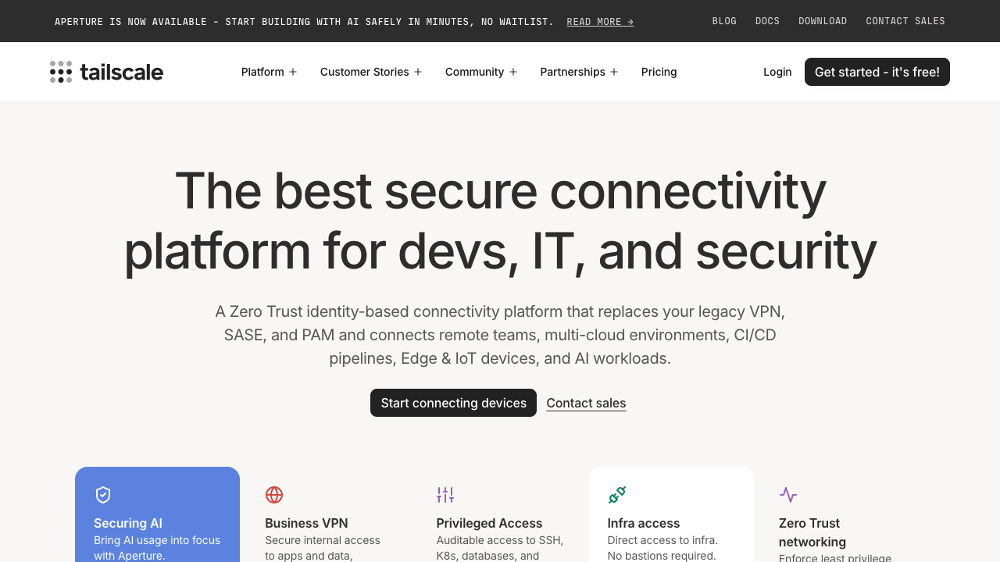
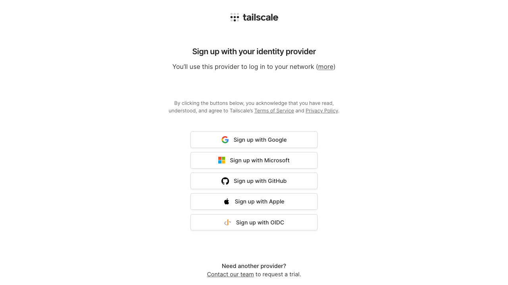
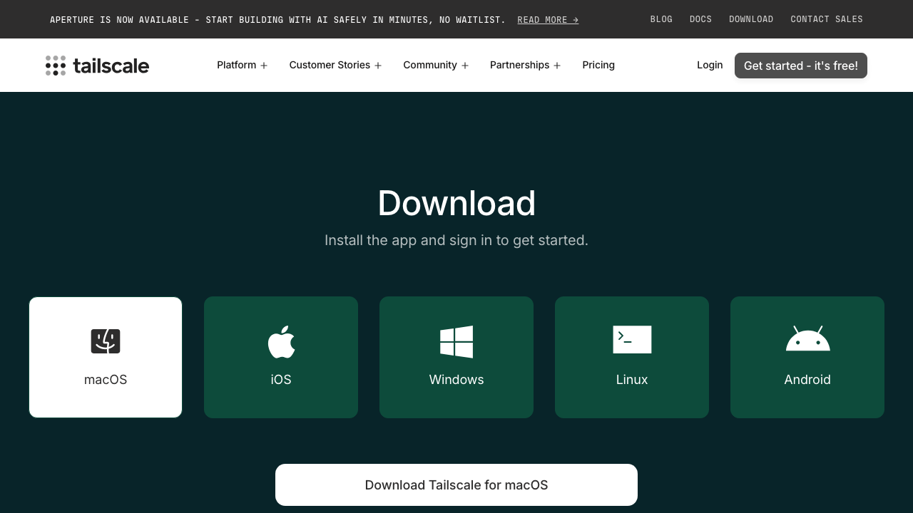
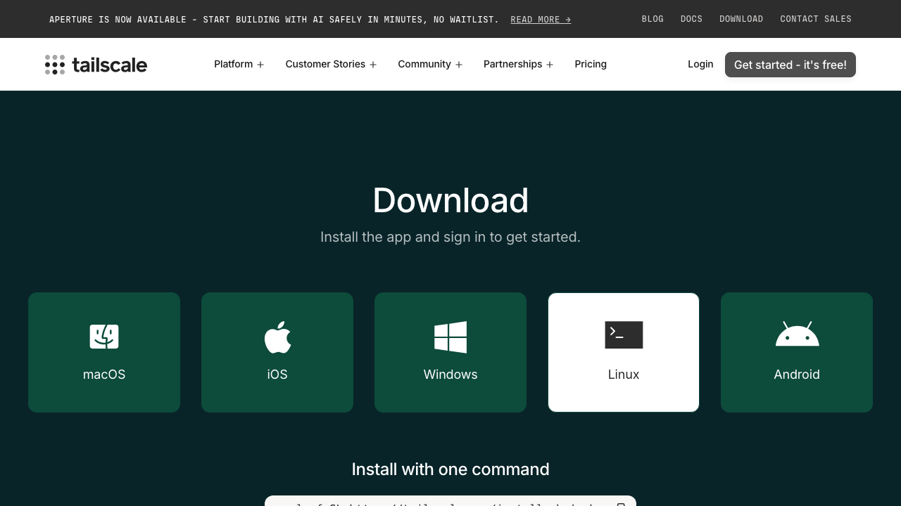
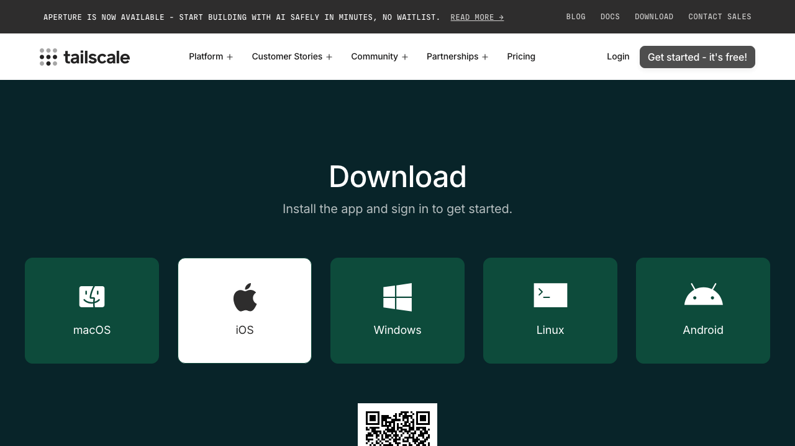
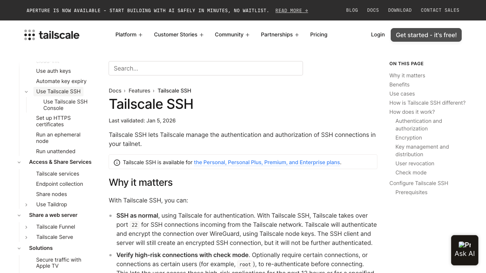
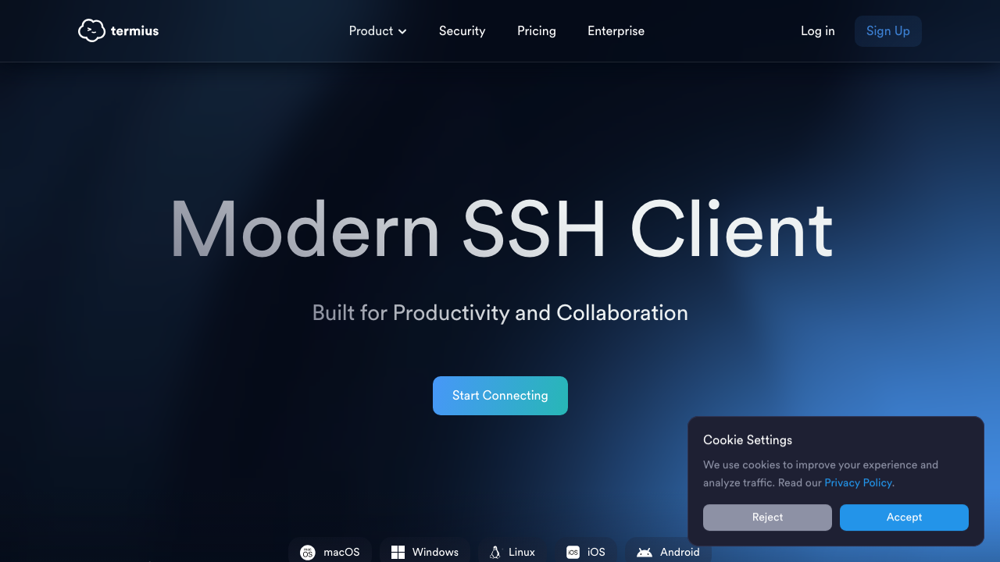

# Setup Guide: Tailscale + SSH + tmux + Claude Code

Run 8 Claude Code agents in parallel from anywhere — even your phone.

---

## Step 1: Sign up for Tailscale

Go to [tailscale.com](https://tailscale.com) and click **"Get started - it's free!"**



Choose your sign-in method — Google, Microsoft, GitHub, or Apple. No credit card needed.



---

## Step 2: Install Tailscale on your server

Go to [tailscale.com/download](https://tailscale.com/download) and pick your platform.



**For Linux servers** — just paste this one command:



```bash
curl -fsSL https://tailscale.com/install.sh | sh
```

Then start Tailscale and enable SSH:

```bash
sudo tailscale up
tailscale set --ssh
```

That's it. Your server is now accessible from all your other devices through Tailscale.

---

## Step 3: Install Tailscale on your laptop/phone

Download Tailscale on every device you want to connect from:

- **Mac/Windows**: [tailscale.com/download](https://tailscale.com/download)
- **iPhone/iPad**: App Store → "Tailscale"
- **Android**: Google Play → "Tailscale"



Sign in with the **same account** you used in Step 1. All your devices will automatically see each other.

---

## Step 4: SSH into your server

From your laptop, open Terminal and type:

```bash
ssh your-username@your-server-name
```

> No SSH keys needed! Tailscale handles all the authentication automatically.



---

## Step 5: Install tmux and Claude Code

On your server, install tmux and Claude Code:

```bash
# Install tmux
sudo apt install tmux          # Ubuntu/Debian
brew install tmux              # macOS

# Install Claude Code
npm install -g @anthropic-ai/claude-code
```

Copy the included tmux config for a better experience:

```bash
cp configs/.tmux.conf ~/.tmux.conf
```

---

## Step 6: Launch 8 Claude Code agents

This is the magic. Run the included script:

```bash
./configs/dev-session.sh 8
```

This creates a tmux session with **8 panes in a tiled layout**, each ready for Claude Code.

In each pane, type `claude` and give it a task:

| Pane | Task |
|------|------|
| 1 | "Write tests for the auth module" |
| 2 | "Refactor the database layer" |
| 3 | "Build the new /api/v2/users endpoint" |
| 4 | "Fix bug #42 in payments" |
| 5 | "Write API documentation" |
| 6 | "Create the database migration" |
| 7 | "Review PR #128" |
| 8 | "Optimize slow queries" |

**Key shortcuts:**
- Switch panes: `Alt + Arrow keys`
- Zoom a pane (fullscreen): `Ctrl-a` then `z`
- Detach (agents keep running): `Ctrl-a` then `d`
- Reattach later: `tmux a -t agents`

---

## Step 7: Access from your phone

Install **Termius** on your phone — it's the best mobile SSH client.



1. Download [Termius](https://termius.com) from App Store or Google Play
2. Add a new host → enter your server's Tailscale hostname
3. Connect → type `tmux a -t agents`
4. All 8 agents are right there on your phone!

**Tips for mobile:**
- Zoom a pane with `Ctrl-a` then `z` — makes it full screen, much easier to read
- Landscape mode works better for tmux
- Use Termius keyboard shortcuts bar

---

## The Workflow

1. **Start agents** on your server
2. **Assign tasks** to each pane
3. **Monitor progress** — switch between panes
4. **Disconnect** anytime — close your laptop, walk away
5. **Reconnect** from any device — phone, tablet, another laptop
6. **All 8 agents are still running**, exactly where you left them

That's it. You're now managing 8 AI developers from anywhere in the world.

---

## Configs

- [`.tmux.conf`](../configs/.tmux.conf) — Production-grade tmux configuration
- [`dev-session.sh`](../configs/dev-session.sh) — Script to launch N Claude Code panes

## Links

- [Tailscale](https://tailscale.com) — Free mesh VPN
- [Tailscale SSH docs](https://tailscale.com/docs/features/tailscale-ssh) — SSH without keys
- [Claude Code](https://claude.ai/code) — AI coding agent
- [Termius](https://termius.com) — Mobile SSH client
- [tmux cheat sheet](https://tmuxcheatsheet.com) — Key bindings reference
